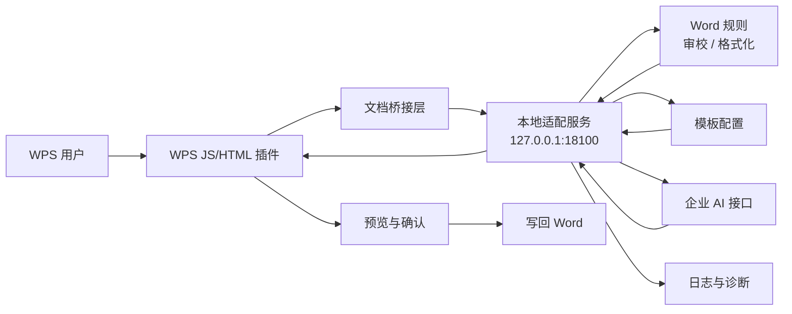

<h1 align="center">AI-WPS</h1>

<p align="center">
  <strong>面向内网办公终端的 WPS AI 助手</strong>
  <br />
  基于 WPS 原生插件、本地适配服务、企业 AI 接口与离线交付工具链构建。
</p>

<p align="center">
  <a href="./README.md">English</a>
  <span> | </span>
  <a href="./README-ZH.md">中文</a>
</p>

<p align="center">
  
  
  
  
</p>

<p align="center">
  
  
  
  
</p>

<p align="center">
  <code>Word 审校</code>
  <code>自动格式预览</code>
  <code>改写/续写</code>
  <code>模板化规则</code>
  <code>运行时探测</code>
  <code>离线交付</code>
</p>

<br />

<table align="center">
  <tr>
    <td align="center" width="190">
      <strong>WPS 原生插件</strong>
      <br />
      <sub>轻量 task pane 与文档桥接</sub>
    </td>
    <td align="center" width="190">
      <strong>本地适配服务</strong>
      <br />
      <sub>规则、模板、日志与诊断控制面</sub>
    </td>
    <td align="center" width="190">
      <strong>企业 AI 接入</strong>
      <br />
      <sub>内网 provider 接入与 mock 回退</sub>
    </td>
    <td align="center" width="190">
      <strong>离线交付</strong>
      <br />
      <sub>安装、启动、探测、验收一体化</sub>
    </td>
  </tr>
</table>

---

## 项目简介

AI-WPS 是一个面向内网办公终端的 WPS AI 助手项目。它采用 **WPS 原生 JS/HTML 插件 + 本地 Python 适配服务 + 企业内网 AI 接口** 的架构，让插件侧保持轻量，把规则、模板、配置、日志、诊断和 AI 调用统一放在本地服务层处理。

当前阶段聚焦 **Phase 1: 平台基础能力 + Word 场景**，目标是在 Kylin V10 ARM、离线部署、内网可用的环境中提供可演示、可验收、可继续扩展的基础版本。

## 核心能力

| 能力 | 说明 |
| --- | --- |
| Word 格式审校 | 检查标题层级、正文字体/字号一致性、重复空格、中文标点前空格等问题 |
| Word 自动格式预览 | 基于模板生成段落样式调整计划，先预览再应用 |
| Word 改写/续写 | 读取当前选区或文档内容，调用企业 AI 接口生成改写结果；未配置密钥时使用本地 mock 回退 |
| 模板化规则 | 通过 `templates/` 管理通用办公模板与后续企业模板 |
| 本地适配服务 | FastAPI 服务暴露统一 HTTP 接口，负责配置、模板、规则、AI provider、日志与错误归一化 |
| 运行时探测 | 提供 WPS 插件环境、活动文档、选区、localhost 适配服务连通性检查 |
| 离线交付 | 提供安装、启动、诊断、卸载和多种交付包构建脚本 |

## 架构



核心原则：

- AI 或格式化结果不会直接写回文档，必须先展示预览并由用户确认。
- WPS 插件只负责 UI、文档读取、预览和写回；复杂规则与 AI 编排放在本地适配服务。
- 文档内容以结构化 payload 传递，保留段落、标题、字体、字号、对齐、层级等信息。

## 仓库结构

| 路径 | 作用 |
| --- | --- |
| `wps-addon/` | WPS 插件源码，使用 Vite + TypeScript 构建 task pane |
| `adapter_service/` | Python 本地适配服务，包含 FastAPI API、规则服务、provider client 与测试 |
| `templates/` | 办公模板与审校规则配置 |
| `config/` | 适配服务运行配置示例 |
| `packaging/` | 离线安装、启动、诊断、卸载和交付包构建脚本 |
| `formal-plugin-kit/` | 正式 WPS 插件手工导入包 |
| `probe-kit/` | 目标机器运行时探测包 |
| `adapter-start-kit/` | 本地适配服务手工启动包 |
| `docs/` | 设计、部署、验收与运维说明 |
| `jsaddons/` | WPS 插件导入/发布相关产物与现场验证材料 |

## 快速开始

### 1. 启动本地适配服务

```bash
cd adapter_service
python -m venv .venv
source .venv/bin/activate
pip install -r requirements.txt
uvicorn app.main:app --host 127.0.0.1 --port 18100
```

Windows PowerShell 可使用：

```powershell
cd adapter_service
python -m venv .venv
.\.venv\Scripts\Activate.ps1
pip install -r requirements.txt
uvicorn app.main:app --host 127.0.0.1 --port 18100
```

健康检查：

```bash
curl http://127.0.0.1:18100/health
```

如果目标环境不方便安装 FastAPI 依赖，也可以使用仓库内置的轻量 standalone 服务：

```bash
python adapter_service/standalone_adapter.py 18100
```

### 2. 构建 WPS 插件前端

```bash
cd wps-addon
npm install
npm run test
npm run build
```

构建产物会输出到 `wps-addon/dist/`。正式内网终端可优先使用 `formal-plugin-kit/` 中已经整理好的手工导入结构。

### 3. 配置企业 AI 接口

复制示例配置：

```bash
cp config/adapter.example.json config/adapter.json
```

关键配置项：

```json
{
  "servicePort": 18100,
  "providerType": "enterprise-chat-api",
  "providerBaseUrl": "https://aibot.chinasatnet.com.cn/v1",
  "providerApiKeyEnv": "ENTERPRISE_AI_API_KEY",
  "providerChatPath": "/chat-messages",
  "providerMode": "blocking",
  "logPath": "./logs/adapter.log",
  "templateRoot": "./templates",
  "timeoutSeconds": 30
}
```

推荐通过环境变量提供密钥：

```bash
export ENTERPRISE_AI_API_KEY="your-api-key"
```

未配置密钥时，`/word/rewrite` 会走本地 mock 响应，方便离线开发和基础验收。

## API 一览

| 方法 | 路径 | 用途 |
| --- | --- | --- |
| `GET` | `/health` | 检查适配服务状态、版本和 provider 配置状态 |
| `GET` | `/config` | 查看当前运行配置摘要 |
| `GET` | `/templates` | 获取可用模板列表 |
| `GET` | `/provider/status` | 查看企业 AI provider 认证状态 |
| `POST` | `/provider/api-key` | 保存本地 API key |
| `DELETE` | `/provider/api-key` | 清除本地 API key |
| `POST` | `/word/proofread` | Word 结构化审校 |
| `POST` | `/word/format-preview` | Word 自动格式化预览 |
| `POST` | `/word/rewrite` | Word 选区/正文改写或续写 |

统一响应结构：

```json
{
  "success": true,
  "traceId": "word-proofread-...",
  "taskType": "word.proofread",
  "message": "completed",
  "data": {},
  "errors": []
}
```

## 离线交付

生成完整离线包：

```bash
bash packaging/build_offline_bundle.sh
```

默认产物：

```text
dist-offline/wps-ai-assistant-offline.tar.gz
```

安装到目标目录：

```bash
bash packaging/install.sh "$HOME/.wps-ai-assistant"
```

启动适配服务：

```bash
bash packaging/start_adapter.sh "$HOME/.wps-ai-assistant" 18100
```

诊断：

```bash
bash packaging/diagnose.sh "$HOME/.wps-ai-assistant"
```

卸载：

```bash
bash packaging/uninstall.sh "$HOME/.wps-ai-assistant"
```

其他交付包：

| 命令 | 产物用途 |
| --- | --- |
| `bash packaging/build_formal_plugin_kit.sh` | 生成正式 WPS 插件手工导入包 |
| `bash packaging/build_probe_kit.sh` | 生成目标机器运行时探测包 |
| `bash packaging/build_adapter_start_kit.sh` | 生成适配服务手工启动包 |

## 测试

后端测试：

```bash
cd adapter_service
pytest
```

前端测试：

```bash
cd wps-addon
npm run test
```

## 当前阶段与路线图

当前实现覆盖 Phase 1 的基础闭环：

- WPS 插件 task pane 与按钮入口
- 文档/选区结构化读取
- 本地适配服务健康检查、配置、模板、provider 状态
- Word 审校、格式预览、改写/续写接口
- 预览后写回 Word 的基础能力
- 运行时探测与离线交付脚本

后续 Phase 2 可在同一适配层之上扩展：

- Excel 报告生成
- Excel 多表/多文件比对
- PPT 大纲生成
- 更完整的企业模板、审计、权限和知识库治理能力
