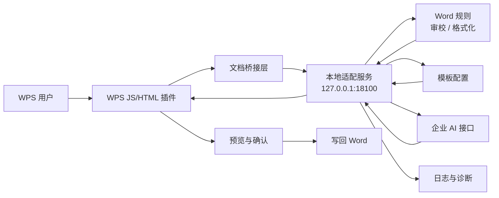

<h1 align="center">AI-WPS</h1>

<p align="center">
  <strong>面向内网办公终端的 WPS AI 助手</strong>
  <br />
  基于 WPS 原生插件、本地适配服务、企业 AI 接口与离线交付工具链构建。
</p>

<p align="center">
  <a href="./README.md">English</a>
  <span> | </span>
  <a href="./README-ZH.md">中文</a>
</p>

<p align="center">
  
  
  
  
</p>

<p align="center">
  
  
  
  
</p>

<p align="center">
  <code>智能编写</code>
  <code>智能仿写</code>
  <code>文档审查</code>
  <code>格式审查</code>
  <code>智能分析</code>
  <code>智能总结</code>
  <code>模板化规则</code>
  <code>运行时探测</code>
  <code>离线交付</code>
</p>

<br />

<table align="center">
  <tr>
    <td align="center" width="190">
      <strong>WPS 原生插件</strong>
      <br />
      <sub>轻量 task pane 与文档桥接</sub>
    </td>
    <td align="center" width="190">
      <strong>本地适配服务</strong>
      <br />
      <sub>规则、模板、日志与诊断控制面</sub>
    </td>
    <td align="center" width="190">
      <strong>企业 AI 接入</strong>
      <br />
      <sub>内网 provider 接入与 mock 回退</sub>
    </td>
    <td align="center" width="190">
      <strong>离线交付</strong>
      <br />
      <sub>安装、启动、探测、验收一体化</sub>
    </td>
  </tr>
</table>

---

## 项目简介

AI-WPS 是一个面向内网办公终端的 WPS AI 助手项目。它采用 **WPS 原生 JS/HTML 插件 + 本地 Python 适配服务 + 企业内网 AI 接口** 的架构，让插件侧保持轻量，把规则、模板、配置、日志、诊断和 AI 调用统一放在本地服务层处理。

当前阶段聚焦 **Phase 1: 平台基础能力 + Word/Excel/PPT 场景**，目标是在 Kylin V10 ARM、离线部署、内网可用的环境中提供可演示、可验收、可继续扩展的基础版本。

## 当前版本

| 项目 | 内容 |
| --- | --- |
| 当前版本 | `v0.19.1-alpha` |
| 版本规则号 | `AI-WPS-P1-WORD-EXCEL-PPT-0.19.1-20260724` |
| 当前阶段 | `P1` 平台底座 + Word + Excel + PPT |
| 运行目标 | 麒麟 V10 ARM、Python 3.8、WPS 原生 JS 插件 |
| 交付状态 | 内部测试版，尚非最终生产发布版 |
| 一期交付包 | Word/Excel/PPT 单一正式交付包；目标产物为 `dist-phase1-delivery-kit/ai-wps-phase1-delivery-20260724-v0191.tar.gz` |

版本规则格式：

```text
AI-WPS-P{阶段}-{范围}-{主版本.次版本.修订号}-{日期}
```

规则说明：

- `阶段`：项目阶段，例如 `P1`、`P2`。
- `范围`：当前主要交付范围，例如 `WORD`、`EXCEL`、`PPT`、`DELIVERY`。
- `主版本`：架构或兼容性边界变化。
- `次版本`：用户可感知的新能力。
- `修订号`：问题修复、界面优化、打包更新和文档更新。
- `日期`：构建或里程碑日期，格式为 `yyyymmdd`。

## 核心能力

| 能力 | 说明 |
| --- | --- |
| WPS 原生任务窗格 | 支持麒麟/WPS 目标终端已验证的 `jsaddons` 手工导入结构 |
| 宿主区分入口 | Word 只显示智能编写、智能仿写、文档审查、格式审查和设置；Excel 只显示“智能分析”和设置；PPT 只显示“智能总结”和设置 |
| 独立任务窗格模式 | Word、Excel 和 PPT 使用独立宿主插件，避免按钮互相交叉显示 |
| 文档审查 | 面向选中文本或限量全文抽取，独立 `word.document_review` Dify 工作流检查错别字、语言表达、逻辑、通畅性和对应文档类型专业性；模型后台返回较慢时任务窗格会持续显示等待反馈 |
| 格式审查 | 按《技术文件格式及书写要求》模板检查选中文本或全文格式合规；可保留 AI 段落角色识别，但只输出检查意见，不再写回排版；预览结果按概览、优先处理清单、分组详情和诊断信息展示，便于排查 |
| Word 智能编写 | 合并改写润色、续写扩展、提炼总结和自定义编写，统一走 Dify Chatflow；adapter 通过顶层 `query` 发送完整提示词，并自动兼容旧工作流的 `inputs.query` |
| 智能仿写 | 新增独立 `word.smart_imitation` 模型工作流，支持选中文本或手动粘贴仿写模板、必填仿写需求、选填参考素材，结果只提供预览、纯文本和复制，不提供对照和写回 |
| Word 写作规范 | 随包提供 G企技术写作基础、技术文件文体、网络安全术语和党政公文文体四个可追溯预置包；智能编写可选择明确场景或保守自动匹配，并显示非阻断的“需要核对/表达建议”；本地组织规范继续支持新增、修改、删除、CSV/XLSX 导入预览、冲突跳过、CSV 导出和数据库备份，规范库不可用时任务降级继续，不改变既有写回路径 |
| 智能分析 | 只读 `excel.analysis` 模型工作流，优先分析选中区域，无有效选区时分析当前工作表已用范围；长任务使用后台任务和可恢复轮询，结果提供结构化分析报告和汇报段落，不写回单元格 |
| 智能总结 | 同一个 `ppt.slide_assistant` 工作流档案支持“当前页总结 / 文档总结”双模式。当前页模式读取主标题、可选副标题、正文和相邻页标题；文档模式接受单个 UTF-8 `.md` 或有效 `.docx` 文件，大小不超过 10 MB，并生成整套 5/8/10/12/15 页建议，默认 10 页。两种模式都只预览和复制，绝不写回 PPT |
| 结果预览 | 智能编写会先对选中多段文本的模型输出恢复段落换行，再按内容结构选择朴素或结构化回显：普通段落不额外套排版，标题、列表、序号、表格、加粗等结构尽量正常展示；文档审查、格式审查和诊断信息继续使用安全 Markdown 渲染 |
| 三宿主统一视觉 | Word、Excel、PPT 统一采用浅灰、白色、雾蓝和状态色视觉系统，同时保持宿主隔离和既有业务行为 |
| 模板化规则 | 已接入 `技术文件格式及书写要求.docx` 及其抽取后的 JSON 规则配置 |
| 本地适配服务 | FastAPI 服务优先走 `uvicorn`，缺依赖时自动降级到 `standalone` |
| 工作流配置档案 | 智能编写、智能仿写、文档审查、格式审查、智能分析和智能总结均采用宿主隔离的紧凑档案列表，支持名称、备注、API Key、新建、修改和删除；功能页下拉选择后立即激活，PPT 两种总结模式共用 `ppt.slide_assistant` |
| 设置与联调状态 | 设置页仅显示单一全局 API URL 和各工作流名称、备注、API Key；旧统一 Key 回退仍由 adapter 兼容并在覆盖安装时保留，但不再在任务窗格中展示 |
| Adapter 运维诊断 | 启动包脚本统一管理 uvicorn adapter，健康检查同步显示 provider 配置、路由摘要和最后一次转发诊断；麒麟 V10 目标机可通过 systemd 脚本安装开机自启动 |
| 离线交付 | 提供正式插件包、adapter 启动包、麒麟 V10 ARM Python 3.8 离线依赖包、pip 离线引导包和运维脚本 |
| 一期交付总包 | 一个压缩包和一个安装脚本同时部署 Word、Excel、PPT 三个宿主插件；覆盖安装保留原 API URL、统一 API Key、工作流档案密钥、Word 写作规范数据库和最多三份已有备份，并包含 Excel/PPT Markdown 提示词模板及写作规范 CSV/XLSX 导入模板 |

## 最近更新

| 版本 | 更新点 |
| --- | --- |
| `v0.19.1-alpha` | 在不改变业务工作流的前提下统一优化 Word、Excel、PPT 任务窗格体验：宿主配色的紧凑任务页与设置页、按各宿主 API URL 和工作流档案实时计算的模型接口就绪状态、可扩展任务选项卡、选填备注、悬浮帮助和默认折叠的高级诊断。设置探测采用独立 8 秒预算、单飞刷新、迟到响应废弃和编辑期间暂停，不能覆盖任务状态、结果、长任务编号或未保存设置 |
| `v0.19.0-alpha` | 新增 Word 写作规范库，作用于智能编写、智能仿写和文档审查；支持按任务范围新增、修改、删除，CSV/XLSX 导入预览和冲突跳过，CSV 导出、数据库备份及结果命中摘要。规范库故障时任务降级继续，不影响 Excel/PPT，也不改变任何既有写回链路；覆盖安装保留写作规范数据库和最多三份已有备份 |
| `v0.18.1-alpha` | 统一优化 Word、Excel、PPT 工作流设置交互：任务窗格移除统一 Key 控件，改为宿主隔离的紧凑工作流列表和全宽新建/编辑页；功能页下拉选择后立即激活，当前工作流不可删除，编辑时 Key 留空保持原密钥；adapter 统一 Key 回退及覆盖安装配置保护保持不变 |
| `v0.18.0-alpha` | Excel 当前入口更名为“智能分析”，PPT 升级为“智能总结”当前页/文档双模式；新增单个 UTF-8 Markdown 或有效 DOCX 安全上传、整套 5/8/10/12/15 页建议、1800 秒可恢复轮询、三宿主统一视觉、Excel/PPT Markdown 提示词模板，以及覆盖安装时保留 API URL 和全部 API Key 的单一正式交付包 |
| `v0.17.0-alpha` | 新增只读 PPT 单页助手：识别当前页主标题、可选副标题、正文文本和相邻页标题，支持生成/优化、长任务恢复轮询、预览/纯文本及分类复制；Word、Excel、PPT Ribbon 严格隔离，并由同一个正式交付包覆盖安装，继续保护目标机已有 API URL 和全部 API Key |
| `v0.16.0-alpha` | 新增工作流配置档案：五个任务均可预存多个自定义名称和 API Key，在功能页通过下拉菜单明确切换，设置页支持新增、重命名、单独更换密钥和删除备用档案；旧任务级密钥自动迁移为“当前配置”，安装升级继续保留 API URL 和全部历史密钥，Word/Excel 仍严格分离 |
| `v0.15.2-alpha` | 兼容新旧 Dify Chatflow 用户输入：旧工作流继续使用 `inputs.query`；新版“用户输入”节点通过顶层 `query` 和 `files` 接收内容。adapter 首次请求收到 HTTP 400 时自动切换格式并缓存成功模式，不改业务提示词、超时、结果解析和前端功能 |
| `v0.15.1-alpha` | Excel 智能分析改为与文档审查一致的后台长任务模式：前端使用 10 秒短请求提交和查询状态，任务编号本地保存，连接抖动后持续恢复轮询；adapter 模型等待预算提高到 1800 秒，避免慢模型使任务窗格提前显示连接超时 |
| `v0.15.0-alpha` | 新增首个 Excel 工作流“Excel 智能分析”：Excel 使用独立 `et` 插件入口，只读分析选区或当前工作表已用范围，adapter 新增独立 `excel.analysis` 模型任务，结果提供结构化分析报告和汇报段落；同一个安装包同时部署 Word/Excel 插件并保留目标机运行时配置 |
| `v0.13.8-alpha` | 增强 180 秒附近长耗时文档审查的连接恢复：任务窗口提交可恢复的本地任务编号，保存未完成任务，状态查询使用 10 秒短请求，任务窗格重开后可继续查询，短暂 adapter 连接失败时低频恢复轮询而不丢弃任务 |
| `v0.13.7-alpha` | 优化文档审查记录预览切换：点击“预览审查记录”后显示审查记录预览，再次点击同一按钮可返回初始文档审查结果卡片视图，并保留本地问题处理状态 |
| `v0.13.6-alpha` | 继续增强 think 模式慢模型文档审查等待：文档审查 provider 等待预算提高到 1800 秒；任务窗格状态轮询最多容忍 240 次短暂失败、总等待 60 分钟；轮询阶段遇到 adapter 短暂不可达时改为提示“状态查询暂时未连上本地 adapter”，继续等待后台任务，避免用户把慢模型处理误判为连接失败 |
| `v0.13.5-alpha` | 增强慢模型文档审查等待：文档审查 provider 等待预算提高到 600 秒；任务窗格状态轮询最多容忍 120 次短暂失败、总等待 30 分钟；最终失败提示改为“状态查询多次失败”并引导查看最近一次任务诊断，避免模型仍在处理时误判为连接失败 |
| `v0.13.4-alpha` | 修复格式审查框选文本时的格式识别问题：任务窗格会优先读取选区 `Selection/Range` 段落格式，再退回纯文本；支持解包 WPS COM 返回的字号、对齐等标量值；adapter 侧将 `0pt` 视为未读取到字号，并把 WPS 对齐枚举值如 `3` 规范化为“两端对齐”后再判断 |
| `v0.13.3-alpha` | 优化长文本文档审查的 think 模式稳定性：文档审查 provider 等待预算提高到 240 秒；任务窗格轮询状态时遇到短暂查询失败会继续保留后台任务并自动重试，不再一次查询失败就清空任务并提示 adapter 连接失败 |
| `v0.13.2-alpha` | 稳定安装与慢模型适配：新版交付包安装时保留目标机已有 API URL、统一 API Key 和任务级 API Key；智能编写保持 75 秒默认超时，文档审查改为提交后台任务并轮询完成状态，同时使用更长的 150 秒 provider 预算，格式审查模型角色识别上限为 60 秒；任务窗口前台反馈统一使用“模型后台”等中文说法 |
| `v0.13.1-alpha` | 修复结果体验测试问题：智能编写“对照”视图将改动后文字以黄色高亮显示，并尽量保持标题、列表、表格等结构；文档审查在模型后台超时、不可达或返回后渲染异常时改为给出可读兜底结果和诊断提示，避免任务窗格空白或误报 adapter 无反馈 |
| `v0.13.0-alpha` | 结果可视化体验增强版：集成麒麟 V10 adapter systemd 开机自启动；智能编写结果新增只读“预览 / 对照 / 纯文本”显示切换，提升标题、列表、段落等结果预览体验且不改写回逻辑；文档审查新增问题处理状态、复制建议/改写、生成并复制审查记录 |
| `v0.12.16-alpha` | 优化格式审查结果可读性：新增审查概览、优先处理清单、分组详情和诊断信息；段落角色、规则项、模板名、识别来源、AI 兜底原因等反馈尽量中文化显示；字体、字号、样式名、对齐、行距、缩进等值也转为中文表达，例如字体标准显示“宋体”、字号标准显示“小四（12pt）”；启动包新增麒麟 V10 systemd 开机自启动安装/卸载脚本 |
| `v0.12.15-alpha` | 稳定文档审查现场体验：点击“审查”后立即显示读取、提交和等待 Dify 的进度反馈；文档审查改为异步限量抽取，避免同步全文扫描卡住任务窗格；Dify 返回非标准 JSON 或普通 Markdown 时，adapter 会保留原始模型回复并在前台展示 |
| `v0.12.14-alpha` | 修复智能编写框选连续两个段落后模型输出被压成一行的问题：任务窗格会先对模型结果自动排版，再进入结果预览和写回；已存在换行会保留，未换行的多段输出会按句意边界恢复分段，内联中文序号/标题也会自动拆行 |
| `v0.12.13-alpha` | 优化智能编写结构化内容处理：框选文本或模型结果包含标题、列表、序号、表格、加粗等结构时，结果区自动使用结构化回显并在写回时尽量保留对应格式；普通段落仍保持朴素回显和原文段落形态写回，避免冗余排版 |
| `v0.12.12-alpha` | 修复智能编写选区场景的两类问题：点击生成时只轻量读取选中文本并异步发起请求，避免同步扫描全文导致任务窗格卡顿；智能编写结果改为朴素文本回显并保留换行，写回时优先按原文段落形态替换选区，同时提示词要求保持原文段落结构、不要额外添加 Markdown 标题/列表/表格 |
| `v0.12.11-alpha` | 文档审查结果按错别字、语言表达、逻辑表达、通畅性、专业性分组展示；格式审查结果按页面设置、标题层级、正文格式、段落格式、图表题/注释、其他格式项分组展示；设置页新增“最近一次任务诊断”，可查看并复制脱敏的 adapter/provider/Dify 请求摘要；不改变智能编写、文档审查、格式审查的接口路径和任务级 API Key 选路逻辑 |
| `v0.12.10-alpha` | 修复格式审查在发起 adapter 请求前卡死的问题：格式审查前端改为限量读取 WPS 段落，框选文本时不再扫描全文，先刷新“正在读取”状态再异步抽取文档，并同步提升前端缓存版本确保目标机加载新资源 |
| `v0.12.9-alpha` | 合并审查类入口：原格式校对与技术文档审查合并为“文档审查”并使用 `word.document_review`；原智能排版改为只检查不写回的“格式审查”并使用 `word.format_review`；清理旧 Word 路由，保持智能编写和任务级 API Key 选路逻辑不变 |
| `v0.12.8-alpha` | 重构格式校对：保留本地确定性格式检测，并新增小批量 AI 文档质量审校，覆盖错别字、语病、表述、逻辑和通畅性；`word.proofread` 继续使用独立任务 API Key 和独立 Dify 工作流 |
| `v0.12.7-alpha` | 修复目标机智能编写、智能排版 HTTP 422：前端发送前清洗 WPS 宿主对象属性，后端对缺失 `documentId/plainText`、对象形态字号/样式和 WPS 下划线枚举做容错；请求校验失败时 `/provider/debug-last` 会记录 `request_validation_failed` |
| `v0.12.6-alpha` | 继续修复智能排版现场段落采集和诊断：支持 `Paragraph.Range.Text`、`Content.Paragraphs`、`Range().Paragraphs` 和全文文本拆段兜底；无段落、未配置任务密钥、Dify 返回不可解析时都会在结果预览和 `/provider/debug-last` 给出明确原因 |
| `v0.12.5-alpha` | 修复 WPS COM 集合形态下智能排版读取到 0 个段落的问题：任务窗口支持 `Paragraphs.Count`/`Item()` 段落集合，应用预览也使用同一集合适配，并将智能排版固定为全文排版预览 |
| `v0.12.4-alpha` | 加固智能排版 Dify 角色识别解析：兼容 `result`、`data`、`outputs` 等包裹层和 JSON 数组返回；AI 解析失败会在任务窗口显示明确提示，并继续使用本地模板规则兜底 |
| `v0.12.3-alpha` | 优化智能编写任务窗口：压缩设置区并扩大 Markdown 结果预览；表达风格、侧重点、篇幅菜单按国企技术方案/汇报材料场景重新合并命名；adapter 提示词映射保留旧值兼容 |
| `v0.12.2-alpha` | 修复长文档智能排版仅将前 120 个非空段落送入 AI 角色识别的问题：adapter 按批次覆盖全文并显示覆盖统计；任务窗口及 Ribbon 图标同步更新为明亮的雾蓝银白配色 |
| `v0.12.1-alpha` | 修复现场任务窗格可能继续加载旧纯文本资源的问题：Ribbon 打开任务窗格和页面静态资源均附加构建版本参数，设置诊断区显示前端版本；`/provider/debug-last` 新增脱敏 Markdown 特征摘要，用于区分 Dify 返回内容和前端渲染问题 |
| `v0.12.0-alpha` | 智能排版按上传的《技术文件格式及书写要求》模板重建规则：输出带 `targetProperties` 的排版预览，支持页面设置、标题、正文、图表题、注、列项、附录和表正文；设置页新增任务级 API Key，智能排版可使用独立 Dify key，未配置时回退统一 key |
| `v0.11.8-alpha` | 增强任务窗口 Markdown 成品预览：保留正文分段和单换行，补充分隔线与表格渲染，结果区更接近 Dify 的排版层次 |
| `v0.11.7-alpha` | 修复 uvicorn Word 路由缓存启动时 provider settings 的问题；设置页保存 API URL 后，智能编写会在配置判定和转发前重新读取最新配置，不再出现 health 已配置但任务仍走 mock |
| `v0.11.6-alpha` | adapter 启动包运维脚本统一收敛到 uvicorn，状态/健康/日志脚本暴露 provider 配置和转发诊断；mock 回退也写入 `/provider/debug-last`，可直接看到未真实转发原因 |
| `v0.11.5-alpha` | 任务窗口结果预览支持安全 Markdown 渲染，Dify 返回的标题、列表、引用、代码块和链接会按格式显示；复制和写回仍使用原始模型文本 |
| `v0.11.4-alpha` | 重新对齐 Dify 官方 `/chat-messages`：顶层 `query` 供 `sys.query` 使用，同时把同一份完整提示词写入 `inputs.query` 供开始节点自定义 `query` 使用；新增脱敏的 `/provider/debug-last` 诊断接口 |
| `v0.11.1-alpha` | 收紧任务路由密钥选择，命名工作流任务只使用自己的 `apiKeyRef`；旧目标机配置自动补齐默认任务路由；设置页摘要移除全局密钥状态；新增路由诊断信息；同步更新 adapter 版本检查 |
| `v0.11.0-alpha` | 将智能改写和智能续写合并为智能编写，智能编写改为 Dify Workflow `/workflows/run` 严格输入变量（`source_text`、`write_action`、`style`、`focus`、`length`、`user_prompt`、`selection_mode`、`trace_id`），设置页移除全局 API Key 和运行探针，仅保留全局 URL + 每任务 Key；同步刷新 Ribbon 图标，并新增正式设计文档作为非 bug 改动的开发准绳 |
| `v0.10.3-alpha` | 优化任务窗格提示词展示：仅智能改写/续写显示提示词拆解卡片，格式校对、智能排版、技术文档审查恢复简洁视图，并将补充输入占位文案改为“补充要求” |
| `v0.10.2-alpha` | 修复智能改写/续写 Dify Chat 入参：按 `/chat-messages` 标准发送顶层 `query`，并在 `inputs` 中同步 `text`、`mode`、`query`、`prompt`，避免工作流节点读不到原文和任务模式导致原样返回 |
| `v0.10.1-alpha` | 优化智能改写/续写任务窗格，显性展示“风格、侧重点、篇幅、输出约束”对应提示词，将“补充要求”调整为改写/续写提示词区域，并保留用户补充输入 |
| `v0.10.0-alpha` | 将 provider 路线升级为“单 providerBaseUrl + taskRoutes + 每任务 path/apiKeyRef/payloadStyle”，adapter 按任务直接调用对应 Dify 应用或工作流，设置页新增任务接口密钥维护区域，并补充多任务 Dify 路由部署手册 |
| `v0.9.1-alpha` | 修复目标机旧 uvicorn adapter 占用 `18100` 导致插件命中旧接口的问题，启动脚本会按版本替换旧进程；模板下拉合并后端模板与本地兜底模板；技术文档审查收敛为技术方案、合同验收文档、测试大纲和细则三类，并按文档类型自动切换审查提示词 |
| `v0.8.0-alpha` | 新增第六个 Ribbon 工作流“技术文档审查”，支持文档类型选择和透明可编辑审查提示词，用于检查功能描述准确性、术语专业性、设计合理性和要求明确性；同时增强结构化审校能力，WPS 插件抽取 `documentStructure`，adapter 将文档结构和本地规则发现传给企业 Dify User Input |
| `v0.7.1-alpha` | 修正一期交付总包默认 WPS `jsaddons` 安装路径为 `/home/cloud/.local/share/Kingsoft/wps/jsaddons`，并同步交接文档和重新打包 |
| `v0.7.0-alpha` | 新增一期交付总包，提供一键安装、pip/运行依赖离线安装、WPS `jsaddons` 自动部署、`publish.xml` 写入、一键联调和验收模板 |
| `v0.6.9-alpha` | 修复 uvicorn 从 `adapter_service/` 目录启动时模板路径解析错误的问题，恢复 `/templates`、格式校对和智能排版对启动包模板文件的访问 |
| `v0.6.8-alpha` | 修复模型配置清空逻辑：空的大模型 API URL 可以保存，模型提供商名称会随 URL 一起保存，并且只有 API URL 与 API Key 同时存在时才显示已配置 |
| `v0.6.7-alpha` | 修复旧 standalone adapter 占用 `18100` 导致 uvicorn 未真正启动的问题，健康检查增加运行模式提示，将裸露的 `Failed to fetch` 改为可执行诊断信息，并稳定单一模型供应商 URL/API Key 保存反馈 |
| `v0.6.6-alpha` | 修复 Python 3.8 离线依赖缺少 `exceptiongroup` 的安装问题，新增 uvicorn 一键启动说明，模板下拉增加本地兜底，并将设置页回退为单一模型供应商配置 |
| `v0.6.5-alpha` | 修复 Ribbon 图标显示为问号的问题，模型提供商名称改为可配置，并支持从后台多个 provider 中选择当前激活接口 |
| `v0.6.4-alpha` | 新增模型提供商卡片与编辑下钻，优化 adapter 未启动时的 mock 提示，增加 Ribbon 图标回调兜底，并提供无 pip 目标机的 Python 3.8 离线 pip 引导包 |
| `v0.6.3-alpha` | 移除任务窗格冗余标题和状态文字，放大结果预览复制按钮，并新增企业大模型 API URL 可配置能力 |
| `v0.6.2-alpha` | 将任务窗格统一精修为苹果式简约视觉体系，使用轻玻璃卡片、细分割线、一致按钮和结果优先布局 |
| `v0.6.1-alpha` | 简化设置页文字与布局，并确保每次点击 Ribbon 入口时先隐藏上一个任务窗格再打开新任务窗格 |
| `v0.6.0-alpha` | 将 WPS AI 助理选项卡改为五个任务入口，任务窗格拆分为独立 Word 工作流，统一中文标题，并将模板选择放入格式校对和智能排版 |
| `v0.5.1-alpha` | 增加简约 Ribbon 按钮图标，并将模板选择迁移到设置页，让首页聚焦高频文档操作 |
| `v0.5.0-alpha` | 接入公司 Word 标准模板，支持模板驱动格式审校、排版预览和 AI 错别字检查 |
| `v0.4.x-alpha` | 增加麒麟 V10 ARM / Python 3.8 离线运行依赖包，支持 `uvicorn` 正式模式 |
| `v0.3.x-alpha` | 优化任务窗格交互：首页紧凑化、设置/诊断分区、当前范围自动识别、复制结果 |
| `v0.2.x-alpha` | 增加 API Key 界面导入、选区改写/续写、企业 provider mock 回退 |
| `v0.1.x-alpha` | 完成 adapter 基线 API、格式校对、排版预览、改写、探针包和启动脚本 |

## 架构



核心原则：

- AI 或格式化结果不会直接写回文档，必须先展示预览并由用户确认。
- WPS 插件只负责 UI、文档读取、预览和写回；复杂规则与 AI 编排放在本地适配服务。
- 文档内容以结构化 payload 传递，保留段落、标题、字体、字号、对齐、层级等信息。

## 仓库结构

| 路径 | 作用 |
| --- | --- |
| `wps-addon/` | WPS 插件源码，使用 Vite + TypeScript 构建 task pane |
| `adapter_service/` | Python 本地适配服务，包含 FastAPI API、规则服务、provider client 与测试 |
| `templates/` | 办公模板与审校规则配置 |
| `config/` | 适配服务运行配置示例 |
| `packaging/` | 离线安装、启动、诊断、卸载和交付包构建脚本 |
| `formal-plugin-kit/` | 正式 WPS 插件手工导入包 |
| `probe-kit/` | 目标机器运行时探测包 |
| `adapter-start-kit/` | 本地适配服务手工启动包 |
| `docs/` | 设计、部署、验收与运维说明 |
| `jsaddons/` | WPS 插件导入/发布相关产物与现场验证材料 |

## 快速开始

### 1. 启动本地适配服务

```bash
cd adapter_service
python -m venv .venv
source .venv/bin/activate
pip install -r requirements.txt
uvicorn app.main:app --host 127.0.0.1 --port 18100
```

Windows PowerShell 可使用：

```powershell
cd adapter_service
python -m venv .venv
.\.venv\Scripts\Activate.ps1
pip install -r requirements.txt
uvicorn app.main:app --host 127.0.0.1 --port 18100
```

健康检查：

```bash
curl http://127.0.0.1:18100/health
```

如果目标环境不方便安装 FastAPI 依赖，也可以使用仓库内置的轻量 standalone 服务：

```bash
python adapter_service/standalone_adapter.py 18100
```

### 2. 构建 WPS 插件前端

```bash
cd wps-addon
npm install
npm run test
npm run build
```

构建产物会输出到 `wps-addon/dist/`。正式内网终端可优先使用 `formal-plugin-kit/` 中已经整理好的手工导入结构。

### 3. 配置企业 AI 接口

复制示例配置：

```bash
cp config/adapter.example.json config/adapter.json
```

关键配置项：

```json
{
  "servicePort": 18100,
  "providerName": "企业大模型接口",
  "providerType": "enterprise-dify-chat",
  "providerBaseUrl": "",
  "providerApiKeyEnv": "ENTERPRISE_AI_API_KEY",
  "providerChatPath": "/chat-messages",
  "providerMode": "blocking",
  "logPath": "./logs/adapter.log",
  "templateRoot": "./templates",
  "timeoutSeconds": 75,
  "taskApiKeyRefs": {
    "word.smart_write": "word_smart_write",
    "word.smart_imitation": "word_smart_imitation",
    "word.document_review": "word_document_review",
    "word.format_review": "word_format_review",
    "excel.analysis": "excel_analysis",
    "ppt.slide_assistant": "ppt_slide_assistant"
  }
}
```

推荐通过环境变量提供密钥：

```bash
export ENTERPRISE_AI_API_KEY="your-api-key"
```

工作流档案的 API Key 保存到 `run/provider_api_keys/<ref>`，配置文件只记录自定义名称和密钥引用。智能编写、智能仿写、文档审查、格式审查、智能分析和智能总结都可以保存多个 Dify App Key；切换对下一次新任务生效。PPT 当前页和文档模式使用同一次解析得到的 `ppt.slide_assistant` 密钥调用 Dify `/files/upload` 与 `/chat-messages`。未配置任务密钥时自动回退统一 provider API Key。详细操作见 [工作流配置档案管理手册](./docs/operations/workflow-profile-management.md)。

智能编写对应的 Dify SYSTEM 提示词、结构保留输出规则和联调方式见 [AI-WPS 智能编写 Dify 工作流配置手册](./docs/operations/dify-smart-write-workflow.md)。智能仿写对应配置见 [AI-WPS 智能仿写 Dify 工作流配置手册](./docs/operations/dify-smart-imitation-workflow.md)。文档审查对应的配置见 [AI-WPS 文档审查 Dify 工作流配置手册](./docs/operations/dify-document-review-workflow.md)。格式审查对应的配置见 [AI-WPS 格式审查 Dify 工作流配置手册](./docs/operations/dify-format-review-workflow.md)。Word 企业术语和文体规则的维护、导入、导出、备份、降级和恢复见 [写作规范管理手册](./docs/operations/writing-policy-library.md)。智能分析对应配置见 [Excel 智能分析 Dify 工作流配置手册](./docs/operations/dify-excel-analysis-workflow.md)，智能总结双模式配置见 [PPT 智能总结 Dify 工作流配置手册](./docs/operations/dify-ppt-slide-assistant-workflow.md)。可部署的 Excel/PPT 提示词模板位于 [`docs/prompt-templates/`](./docs/prompt-templates/)。

## API 一览

| 方法 | 路径 | 用途 |
| --- | --- | --- |
| `GET` | `/health` | 检查适配服务状态、版本和 provider 配置状态 |
| `GET` | `/config` | 查看当前运行配置摘要 |
| `GET` | `/templates` | 获取可用模板列表 |
| `GET` | `/provider/status` | 查看企业 AI provider 认证状态 |
| `GET` | `/provider/task-api-keys` | 查看任务级 API Key 配置摘要 |
| `GET` | `/provider/workflow-profiles` | 按任务查看工作流档案和当前选择 |
| `POST` | `/provider/workflow-profiles` | 新增具名工作流档案 |
| `PATCH` | `/provider/workflow-profiles/{profileId}` | 修改档案名称和备注 |
| `POST` | `/provider/workflow-profiles/{profileId}/api-key` | 单独更换档案 API Key |
| `POST` | `/provider/workflow-profiles/{profileId}/activate` | 将档案设为当前工作流 |
| `DELETE` | `/provider/workflow-profiles/{profileId}` | 删除非当前工作流档案 |
| `POST` | `/provider/api-key` | 保存统一 Dify Chat API Key |
| `DELETE` | `/provider/api-key` | 清除统一 Dify Chat API Key |
| `POST` | `/provider/task-api-key` | 保存某个任务的独立 Dify API Key |
| `DELETE` | `/provider/task-api-key/{taskType}` | 清除某个任务的独立 Dify API Key |
| `GET` | `/writing-policies/summary` | 查看 Word 写作规范数量和可用状态 |
| `GET` | `/writing-policies/packs` | 只读查看预置规范包的来源、版本、提交和许可证 |
| `GET` / `POST` | `/writing-policies/items` | 浏览预置条目或查询、新增组织术语与写作规则 |
| `PATCH` / `DELETE` | `/writing-policies/items/{itemId}` | 修改或删除一条写作规范 |
| `GET` | `/writing-policies/import-template.csv` | 下载 CSV 导入模板 |
| `GET` | `/writing-policies/import-template.xlsx` | 下载 XLSX 导入模板 |
| `POST` | `/writing-policies/imports/preview` | 校验导入文件并生成短期预览令牌 |
| `POST` | `/writing-policies/imports/apply` | 应用一次未使用的导入预览并跳过冲突项 |
| `GET` | `/writing-policies/export.csv` | 按筛选条件导出 CSV |
| `GET` | `/writing-policies/backup` | 下载一致性的 SQLite 数据库备份 |
| `GET` | `/writing-policies/diagnostics` | 查看脱敏的规范库健康诊断 |
| `POST` | `/word/smart-write` | 对当前选中文本进行智能编写，支持改写、续写、总结和自定义 |
| `POST` | `/word/smart-imitation` | 根据模板、仿写要求和可选参考素材生成只读仿写结果 |
| `POST` | `/word/document-review` | 文档审查，检查错别字、语言表达、逻辑、通畅性和文档类型专业性 |
| `POST` | `/word/document-review/jobs` | 启动后台文档审查任务，适配模型后台慢响应 |
| `GET` | `/word/document-review/jobs/{jobId}` | 轮询后台文档审查任务状态，直到完成或失败 |
| `POST` | `/word/format-review` | 格式审查，按标准模板输出格式合规检查意见 |
| `POST` | `/excel/analysis` | 智能分析，只读分析选区或当前工作表已用范围 |
| `POST` | `/excel/analysis/jobs` | 提交可恢复的智能分析后台任务 |
| `GET` | `/excel/analysis/jobs/{jobId}` | 查询智能分析后台任务状态 |
| `POST` | `/ppt/document-files` | 校验并暂存单个 UTF-8 `.md` 或有效 `.docx` 文件，大小不超过 10 MB，返回一次性令牌 |
| `POST` | `/ppt/slide-assistant/jobs` | 提交当前页或文档智能总结后台任务 |
| `GET` | `/ppt/slide-assistant/jobs/{jobId}` | 查询或恢复智能总结后台任务 |

统一响应结构：

```json
{
  "success": true,
  "traceId": "word-document-review-...",
  "taskType": "word.document_review",
  "message": "completed",
  "data": {},
  "errors": []
}
```

## 离线交付

一期正式版本只提供一个 Word/Excel/PPT 统一交付包和一个安装脚本。覆盖安装继续保留目标机已有 `config/adapter.json`、统一 API Key、`run/provider_api_keys/`、Word 写作规范数据库和最多三份已有规范库备份；包内同时提供 Excel/PPT Markdown 提示词模板及自动生成的写作规范 CSV/XLSX 导入模板。

生成完整离线包：

```bash
bash packaging/build_offline_bundle.sh
```

默认产物：

```text
dist-offline/wps-ai-assistant-offline.tar.gz
```

安装到目标目录：

```bash
bash packaging/install.sh "$HOME/.wps-ai-assistant"
```

启动适配服务：

```bash
bash packaging/start_adapter.sh "$HOME/.wps-ai-assistant" 18100
```

诊断：

```bash
bash packaging/diagnose.sh "$HOME/.wps-ai-assistant"
```

卸载：

```bash
bash packaging/uninstall.sh "$HOME/.wps-ai-assistant"
```

其他交付包：

| 命令 | 产物用途 |
| --- | --- |
| `bash packaging/build_formal_plugin_kit.sh` | 生成正式 WPS 插件手工导入包 |
| `bash packaging/build_probe_kit.sh` | 生成目标机器运行时探测包 |
| `bash packaging/build_adapter_start_kit.sh` | 生成适配服务手工启动包 |

## 测试

后端测试：

```bash
cd adapter_service
pytest
```

前端测试：

```bash
cd wps-addon
npm run test
```

## 当前阶段与路线图

当前实现覆盖 Phase 1 的基础闭环：

- WPS 插件 task pane 与按钮入口
- 文档/选区结构化读取
- 本地适配服务健康检查、配置、模板、provider 状态
- 智能编写、文档审查、格式审查接口
- 只读智能分析和当前页/文档双模式智能总结
- 预览后写回 Word 的基础能力
- 运行时探测与离线交付脚本

后续 Phase 2 可在同一适配层之上扩展：

- 更丰富的 Excel 报告生成与多表流程
- Excel 多表/多文件比对
- 在当前只预览/复制边界之外受控扩展 PPT 生成流程
- 更完整的企业模板、审计、权限和规范库治理能力
