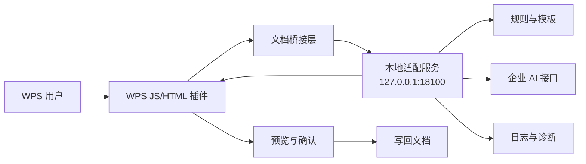

# AI-WPS

面向内网办公终端的 WPS AI 助手。架构是 **WPS 原生 JS/HTML 插件 + 本地 Python 适配服务 + 企业内网 AI 接口**：插件负责界面、读文档、预览和写回，规则、模板、配置、日志、诊断和模型调用放在本机 Adapter。

当前范围是 **Phase 1：平台底座 + Word / Excel / PPT**，运行目标为麒麟 V10 ARM、Python 3.8、离线部署。

[English](./README.md) | [中文](./README-ZH.md)

产品介绍页：[中文](./site/index.html) · [English](./site/en.html)

## 当前版本

| 项目 | 内容 |
| --- | --- |
| 当前版本 | `v0.26.0-preview.1` |
| 版本规则号 | `AI-WPS-WORD-EXCEL-PPT-0.26.0-preview.1` |
| 当前阶段 | `P1` 平台底座 + Word + Excel + PPT |
| 运行目标 | 麒麟 V10 ARM、Python 3.8、WPS 原生 JS 插件 |
| 交付状态 | `v0.26.0-preview.1` 构建后自动化状态为 `candidate`；Issue #120 目标机验收仍为 `manual-pending`；阻塞工单 Issue #119 实现已完成并关闭 |
| 基线状态 | `v0.25.3-alpha` 已依据 Issue #59 完成目标机验收，状态为 `target-accepted` |

`v0.26.0-preview.1` 建立中性的 Preview 交付边界，并新增独立配置的第九任务 Excel“智能填写”。该能力已完成合成数据验证，但仍须目标机验收；当前包不宣称已通过真实 WPS 或模型验收。`v0.25.3-alpha` 的 `target-accepted` 基线仍按 Issue #59 保留记录。

版本规则：`AI-WPS-P{阶段}-{范围}-{主版本.次版本.修订号}-{yyyymmdd}`。主版本改兼容边界，次版本加用户可见能力，修订号覆盖缺陷、界面、打包和文档。

## 版本摘要

| 版本 | 用户可见变化 |
| --- | --- |
| `v0.26.0-preview.1` | Excel“智能填写”作为独立配置的第九任务；受保护的预览和写回 |
| `v0.25.3-alpha` | 结果预览、格式问题卡片、题注关联结论、幻灯片页角色 |
| `v0.25.2-alpha` | 图像语义补充默认开启，视觉关闭降级；PPT 中文模板标题识别 |
| `v0.25.1-alpha` | 格式审查 v2 跨运行时哈希契约、白名单组装、Python 3.8 生命周期门禁 |
| `v0.25.0-alpha` | 确定性格式审查与受限语义 DSL；图像语义休眠交付 |

冻结包：`v0.25.2-alpha` 候选 `20260825-850871c`（SHA-256 `c5d663d1249147104bee66790fea60f5e15675418a51c0c1a7a0fc028a285a92`）；`v0.25.1-alpha` 候选 `20260824-d7a1dd8`（SHA-256 `ec318db4ffbda499c24aa6fb50958628cc4eaa030b22389bbf29cd783b1adbf6`）。前任拒绝记录、门禁数字和构建血缘见 [packaging/v0253-delivery.md](./packaging/v0253-delivery.md)、[packaging/v0252-delivery.md](./packaging/v0252-delivery.md)、[packaging/v0251-delivery.md](./packaging/v0251-delivery.md)。

## 能做什么

Word、Excel、PPT 使用独立插件，Ribbon 互不串门。模型结果先预览，用户确认后才写回；审查类和分析类任务默认只读。

| 宿主 | 入口 | 说明 |
| --- | --- | --- |
| Word | 智能编写 | 改写、续写、提炼、自定义编写；预览 / 对照 / 纯文本后写回 |
| Word | 智能仿写 | 按模板仿写；预览、纯文本、复制，不写回 |
| Word | 文档审查 | 错别字、表达、逻辑、通畅性、专业性；选区或限量全文 |
| Word | 格式审查 | 对照《技术文件格式及书写要求》；格式问题卡片、题注关联结论、图像语义补充；不写回排版 |
| Word | 写作规范 | 四个预置包 + 本机组织规范库；编写 / 仿写 / 审查可选用 |
| Excel | 智能分析 | 选区或已用范围；结构化报告和汇报段落，不写回单元格 |
| Excel | 公式助手 | 明确选区（最多 30×20）；生成或解释排错，只复制 |
| Excel | 智能填写 | 单列连续目标（最多 500 项）；预览、编辑/排除/重试后受保护写回；不提供撤销 |
| PPT | 智能总结 | 当前页，或上传单个 `.md` / `.docx`（≤10 MB）生成整套页建议；只预览和复制 |
| PPT | 结构审查 | 最多 60 页；幻灯片页角色清单；只读 |

本机 Adapter（默认 `127.0.0.1:18100`）承接九类任务的独立模型配置：工作流平台走 `/chat-messages`，模型直连走 OpenAI 兼容 `/chat/completions`。运行时不回退统一 URL 或统一 Key。生产环境默认关闭模拟结果。

## 架构


```mermaid
flowchart LR
  User[WPS 用户] --> Addin[WPS JS/HTML 插件]
  Addin --> Bridge[文档桥接层]
  Bridge --> Adapter[本地适配服务<br/>127.0.0.1:18100]
  Adapter --> Rules[规则与模板]
  Adapter --> Provider[企业 AI 接口]
  Adapter --> Logs[日志与诊断]
  Adapter --> Addin
  Addin --> Preview[预览与确认]
  Preview --> WPS[写回文档]
```

- 插件只做 UI、抽取、预览、写回。
- 文档按结构化 payload 传递，保留段落、标题、字体、字号、对齐和大纲级别。
- 健康状态分为存活、就绪、增强降级和恢复模式；恢复模式禁止改配置和发新模型任务。

## 仓库结构

| 路径 | 作用 |
| --- | --- |
| `wps-addon/` | 插件源码（Vite + TypeScript） |
| `adapter_service/` | 本地 Adapter（FastAPI、规则、provider、测试） |
| `formal-plugin-kit/` | 正式 WPS 手工导入包 |
| `templates/` | 办公模板和审校规则 |
| `config/` | 运行配置示例 |
| `packaging/` | 离线安装、诊断、交付包构建 |
| `phase1-delivery-kit/` | 一期安装器与验收材料 |
| `adapter-start-kit/` | Adapter 手工启动包 |
| `probe-kit/` | 目标机运行时探测 |
| `docs/` | 设计、运维、验收说明 |
| `jsaddons/` | WPS 导入 / 发布相关材料 |

## 快速开始

开发联调可以先起 Adapter、再装插件。内网目标机请用下面的[离线交付](#离线交付)。

### 1. 启动本地适配服务

```bash
cd adapter_service
python -m venv .venv
source .venv/bin/activate
pip install -r requirements.txt
uvicorn app.main:app --host 127.0.0.1 --port 18100
```

健康检查：

```bash
curl http://127.0.0.1:18100/health/live
curl -i http://127.0.0.1:18100/health/ready
curl http://127.0.0.1:18100/health
```

`/health/live` 不读业务数据。`/health/ready` 在核心数据进入恢复模式时返回 503。聚合 `/health` 始终 200，只返回脱敏子系统状态。缺 FastAPI 依赖时可 `python adapter_service/standalone_adapter.py 18100`。恢复模式操作见 [运行数据恢复手册](./docs/operations/runtime-state-recovery.md)。

### 2. 构建或导入插件

```bash
cd wps-addon
npm install
npm test
npm run build
```

产物在 `wps-addon/dist/`。正式终端优先导入 `formal-plugin-kit/`。

### 3. 配置企业 AI 接口

```bash
cp config/adapter.example.json config/adapter.json
export ENTERPRISE_AI_API_KEY="your-api-key"
```

`adapter.json` 只保存接入方式、地址、模型参数和密钥引用；API Key 落在 `run/provider_api_keys/<ref>`。字段说明见 `config/adapter.example.json`，操作见 [模型配置管理手册](./docs/operations/workflow-profile-management.md)。

## 文档

| 文档 | 内容 |
| --- | --- |
| [模型配置](./docs/operations/workflow-profile-management.md) | 工作流平台 / 模型直连、密钥和激活 |
| [写作规范](./docs/operations/writing-policy-library.md) | 预置包、导入导出、备份和降级 |
| [智能编写](./docs/operations/dify-smart-write-workflow.md) | Word 编写工作流 |
| [智能仿写](./docs/operations/dify-smart-imitation-workflow.md) | Word 仿写工作流 |
| [文档审查](./docs/operations/dify-document-review-workflow.md) | Word 文档审查 |
| [格式审查](./docs/operations/dify-format-review-workflow.md) | Word 格式审查 |
| [智能分析](./docs/operations/dify-excel-analysis-workflow.md) | Excel 分析 |
| [公式助手](./docs/operations/dify-excel-formula-assistant-workflow.md) | Excel 公式 |
| [Excel“智能填写”契约](./docs/operations/model-excel-smart-fill-contract.md) | 智能填写输入输出、限制和写回边界 |
| [Excel“智能填写”工作流](./docs/operations/workflow-platform-excel-smart-fill.md) | 工作流平台配置和验证 |
| [智能总结](./docs/operations/dify-ppt-slide-assistant-workflow.md) | PPT 当前页 / 文档总结 |
| [结构审查](./docs/operations/dify-ppt-structure-review-workflow.md) | PPT 结构审查 |
| [提示词模板](./docs/prompt-templates/) | 可部署的 Excel / PPT 模板 |
| [麒麟测试环境](./docs/operations/kylin-v10-test-environment.md) | 目标机与 SSH |

## API 摘要

统一响应：

```json
{
  "success": true,
  "traceId": "word-document-review-...",
  "taskType": "word.document_review",
  "message": "completed",
  "data": {},
  "errors": []
}
```

| 分组 | 路径 |
| --- | --- |
| 健康 | `GET /health/live`、`/health/ready`、`/health` |
| 恢复 | `POST /recovery/backups`、`GET /recovery/diagnostics` |
| 配置 | `GET /config`、`GET /templates`、`GET /provider/status` |
| 模型配置 | `/provider/model-configurations` 及激活、换钥、校验、复制 |
| 写作规范 | `/writing-policies/*`（条目、导入预览、导出、备份） |
| Word | `/word/smart-write/jobs`、`/word/smart-imitation/jobs`、`/word/document-review/jobs`、`/word/format-review/jobs`（v2 快照 / 任务 / 问题 / 报告） |
| Excel | `/excel/analysis/jobs`、`/excel/formula-assistant/jobs`、`/excel/smart-fill/jobs`；兼容预览路径 `/excel/smart-fill` |
| PPT | `/ppt/document-files`、`/ppt/slide-assistant/jobs`、`/ppt/structure-review/jobs` |

`POST /word/format-review` 已退役，固定返回 `410 WORD_FORMAT_REVIEW_SYNC_RETIRED`。长任务一般是提交 jobs、短请求轮询、排队中可取消；运行中的阻塞式模型请求不可取消。

## 离线交付

一期正式版本是一个 Word / Excel / PPT 统一包加一个安装脚本。覆盖安装保留已有 `config/adapter.json`、API Key、写作规范库和已有备份。

```bash
bash packaging/build_offline_bundle.sh
bash packaging/install.sh "$HOME/.wps-ai-assistant"
bash packaging/start_adapter.sh "$HOME/.wps-ai-assistant" 18100
bash packaging/diagnose.sh "$HOME/.wps-ai-assistant"
bash packaging/uninstall.sh "$HOME/.wps-ai-assistant"
```

默认产物：`dist-offline/wps-ai-assistant-offline.tar.gz`。

| 命令 | 用途 |
| --- | --- |
| `bash packaging/build_formal_plugin_kit.sh` | 正式插件手工导入包 |
| `bash packaging/build_probe_kit.sh` | 目标机探测包 |
| `bash packaging/build_adapter_start_kit.sh` | Adapter 手工启动包 |

系统 Python 无 pip 时，安装器对 get-pip 使用 `-sS`，不扫描麒麟 apt 的 `dist-packages`。

## 测试

```bash
cd adapter_service
pytest
```

```bash
cd wps-addon
npm test
```

目标机回归使用麒麟 V10 ARM64 上的 Python 3.8（见 [测试环境](./docs/operations/kylin-v10-test-environment.md)）。交付审计脚本在 `packaging/`。

## 路线图

Phase 1 已覆盖：三宿主任务窗格、结构化抽取、Adapter 健康与配置、九类任务、Word 与 Excel“智能填写”的受保护预览后写回、运行时探测和离线安装。当前中性 Preview 包的目标机状态仍为 `manual-pending`。

后续可以在同一 Adapter 上扩展 Excel 多表流程、多文件比对、受控 PPT 生成，以及更完整的模板、审计和规范库治理。
