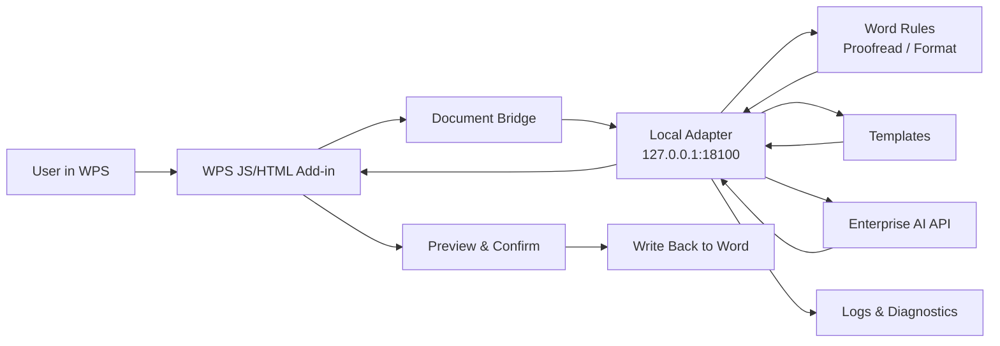

<h1 align="center">AI-WPS</h1>

<p align="center">
  <strong>WPS AI Assistant for Secure Intranet Office Workflows</strong>
  <br />
  A native WPS add-in backed by a local adapter service, enterprise AI providers, and offline delivery tooling.
</p>

<p align="center">
  <a href="./README.md">English</a>
  <span> | </span>
  <a href="./README-ZH.md">Chinese</a>
</p>

<p align="center">
  
  
  
  
</p>

<p align="center">
  
  
  
  
</p>

<p align="center">
  <code>Word Proofread</code>
  <code>Format Preview</code>
  <code>Rewrite / Continue</code>
  <code>Template Rules</code>
  <code>Runtime Probe</code>
  <code>Offline Delivery</code>
</p>

<br />

<table align="center">
  <tr>
    <td align="center" width="190">
      <strong>WPS Native Add-in</strong>
      <br />
      <sub>Lightweight task pane and document bridge</sub>
    </td>
    <td align="center" width="190">
      <strong>Local Adapter</strong>
      <br />
      <sub>Rules, templates, logs, and diagnostics</sub>
    </td>
    <td align="center" width="190">
      <strong>Enterprise AI</strong>
      <br />
      <sub>Intranet provider integration with mock fallback</sub>
    </td>
    <td align="center" width="190">
      <strong>Offline Delivery</strong>
      <br />
      <sub>Install, start, probe, and acceptance tooling</sub>
    </td>
  </tr>
</table>

---

## Overview

AI-WPS is a WPS AI assistant for intranet office terminals. It uses a **WPS native JS/HTML add-in + local Python adapter service + enterprise AI API** architecture. The add-in stays lightweight, while rules, templates, configuration, logging, diagnostics, and AI orchestration live in the local adapter layer.

The current scope is **Phase 1: platform foundation + Word workflows**, designed for Kylin V10 ARM, offline deployment, and intranet-only environments.

## Current Version

| Item | Value |
| --- | --- |
| Version | `v0.6.0-alpha` |
| Version rule number | `AI-WPS-P1-WORD-0.6.0-20260501` |
| Phase | `P1` platform foundation + Word |
| Runtime target | Kylin V10 ARM, Python 3.8, WPS native JS add-in |
| Delivery status | Internal test build, not final production release |

Version rule format:

```text
AI-WPS-P{phase}-{scope}-{major.minor.patch}-{yyyymmdd}
```

Rules:

- `phase`: project phase, such as `P1` or `P2`.
- `scope`: main delivery scope, such as `WORD`, `EXCEL`, `PPT`, or `DELIVERY`.
- `major`: architecture or compatibility boundary changes.
- `minor`: user-visible capability additions.
- `patch`: bug fixes, UI polish, packaging updates, and documentation updates.
- `yyyymmdd`: build or milestone date.

## Highlights

| Capability | Description |
| --- | --- |
| WPS native task pane | Manual-import `jsaddons` compatible plugin layout for Kylin/WPS target terminals |
| Five task entries | WPS AI tab exposes rewrite, continue, proofread, format, and settings as separate ribbon actions |
| Mode-specific task pane | One task pane switches into focused Word workflows based on the clicked ribbon action |
| Word proofreading | Detects heading hierarchy, template font/size/line-spacing violations, repeated spaces, and spacing before Chinese punctuation |
| AI typo check | Uses the enterprise AI provider to detect Chinese typos, wrong words, and suspicious wording; falls back safely when no API key is configured |
| Word format preview | Builds a template-based paragraph style change plan before applying it |
| Word rewrite/continue | Rewrites or continues from the current selected text, calls the enterprise AI API, and supports local mock fallback |
| Template-driven rules | Includes the company template `技术文件格式及书写要求.docx` and its extracted JSON rule profile |
| Local adapter service | FastAPI service with `uvicorn` preferred mode and `standalone` fallback mode |
| Runtime probe and settings | Settings page for API key import, provider status, runtime probe, and diagnostics |
| Offline delivery | Includes formal plugin kit, adapter start kit, Kylin V10 ARM Python 3.8 wheel bundle, and operational scripts |

## Latest Updates

| Version | Update |
| --- | --- |
| `v0.6.0-alpha` | Reworked the WPS AI tab into five task entries, split the task pane into mode-specific Word workflows, localized visible titles, and moved template selection into proofreading and formatting |
| `v0.5.1-alpha` | Added a simple ribbon button icon and moved template selection into settings to keep the home task pane focused |
| `v0.5.0-alpha` | Added company Word template driven proofreading and format preview; added AI typo detection via enterprise provider |
| `v0.4.x-alpha` | Added Kylin V10 ARM offline Python runtime wheel bundle for `uvicorn` mode |
| `v0.3.x-alpha` | Improved task pane interaction: compact home view, settings/diagnostics split, auto scope detection, copy result |
| `v0.2.x-alpha` | Added provider API key UI, selection-only rewrite/continue, and provider mock fallback |
| `v0.1.x-alpha` | Built baseline adapter APIs, proofread, format preview, rewrite, probe kit, and startup scripts |

## Architecture



Design rules:

- AI and formatting results are never written back directly; the user must preview and confirm first.
- The WPS add-in handles UI, document extraction, preview, and write-back. Complex rules and AI orchestration stay in the adapter service.
- Documents are sent as structured payloads, preserving paragraphs, headings, font names, font sizes, alignment, and outline levels.

## Repository Map

| Path | Purpose |
| --- | --- |
| `wps-addon/` | WPS add-in source, built with Vite and TypeScript |
| `adapter_service/` | Local Python adapter service with FastAPI APIs, Word services, provider client, and tests |
| `templates/` | Office templates and proofreading rule configuration |
| `config/` | Runtime adapter configuration examples |
| `packaging/` | Offline install, start, diagnose, uninstall, and package build scripts |
| `formal-plugin-kit/` | Manual import kit for the formal WPS add-in |
| `probe-kit/` | Runtime probe kit for target machines |
| `adapter-start-kit/` | Operator-friendly adapter startup kit |
| `docs/` | Design, deployment, acceptance, and operation notes |
| `jsaddons/` | WPS add-in import/publish artifacts and validation materials |

## Quick Start

### 1. Start the local adapter

```bash
cd adapter_service
python -m venv .venv
source .venv/bin/activate
pip install -r requirements.txt
uvicorn app.main:app --host 127.0.0.1 --port 18100
```

For Windows PowerShell:

```powershell
cd adapter_service
python -m venv .venv
.\.venv\Scripts\Activate.ps1
pip install -r requirements.txt
uvicorn app.main:app --host 127.0.0.1 --port 18100
```

Health check:

```bash
curl http://127.0.0.1:18100/health
```

If FastAPI dependencies are inconvenient in the target environment, use the built-in lightweight standalone server:

```bash
python adapter_service/standalone_adapter.py 18100
```

### 2. Build the WPS add-in frontend

```bash
cd wps-addon
npm install
npm run test
npm run build
```

The frontend build output goes to `wps-addon/dist/`. For formal intranet terminals, prefer the curated manual import layout under `formal-plugin-kit/`.

### 3. Configure the enterprise AI provider

Copy the example config:

```bash
cp config/adapter.example.json config/adapter.json
```

Important fields:

```json
{
  "servicePort": 18100,
  "providerType": "enterprise-chat-api",
  "providerBaseUrl": "https://aibot.chinasatnet.com.cn/v1",
  "providerApiKeyEnv": "ENTERPRISE_AI_API_KEY",
  "providerChatPath": "/chat-messages",
  "providerMode": "blocking",
  "logPath": "./logs/adapter.log",
  "templateRoot": "./templates",
  "timeoutSeconds": 30
}
```

Use an environment variable for the API key:

```bash
export ENTERPRISE_AI_API_KEY="your-api-key"
```

When no API key is configured, `/word/rewrite` returns a local mock response, which is useful for offline development and baseline acceptance.

## API Surface

| Method | Path | Purpose |
| --- | --- | --- |
| `GET` | `/health` | Adapter health, version, and provider configuration status |
| `GET` | `/config` | Current runtime configuration summary |
| `GET` | `/templates` | Available template list |
| `GET` | `/provider/status` | Enterprise AI provider authentication status |
| `POST` | `/provider/api-key` | Save a local API key |
| `DELETE` | `/provider/api-key` | Clear the local API key |
| `POST` | `/word/proofread` | Structured Word proofreading |
| `POST` | `/word/format-preview` | Word auto-format preview |
| `POST` | `/word/rewrite` | Rewrite or continue from Word selection/document content |

Unified response envelope:

```json
{
  "success": true,
  "traceId": "word-proofread-...",
  "taskType": "word.proofread",
  "message": "completed",
  "data": {},
  "errors": []
}
```

## Offline Delivery

Build the full offline bundle:

```bash
bash packaging/build_offline_bundle.sh
```

Default output:

```text
dist-offline/wps-ai-assistant-offline.tar.gz
```

Install to a target directory:

```bash
bash packaging/install.sh "$HOME/.wps-ai-assistant"
```

Start the adapter:

```bash
bash packaging/start_adapter.sh "$HOME/.wps-ai-assistant" 18100
```

Diagnose:

```bash
bash packaging/diagnose.sh "$HOME/.wps-ai-assistant"
```

Uninstall:

```bash
bash packaging/uninstall.sh "$HOME/.wps-ai-assistant"
```

Additional delivery kits:

| Command | Output Purpose |
| --- | --- |
| `bash packaging/build_formal_plugin_kit.sh` | Formal WPS add-in manual import kit |
| `bash packaging/build_probe_kit.sh` | Runtime probe kit for target machines |
| `bash packaging/build_adapter_start_kit.sh` | Manual adapter startup kit |

## Tests

Backend:

```bash
cd adapter_service
pytest
```

Frontend:

```bash
cd wps-addon
npm run test
```

## Status & Roadmap

The current implementation covers the Phase 1 baseline:

- WPS task pane and action buttons
- Structured document/selection extraction
- Local adapter health, config, templates, and provider status
- Word proofreading, format preview, and rewrite/continue APIs
- Preview-first Word write-back
- Runtime probing and offline delivery scripts

Phase 2 can extend the same adapter foundation with:

- Excel report generation
- Excel multi-sheet and multi-file comparison
- PPT outline generation
- Richer enterprise templates, audit, permissions, and knowledge-base governance
