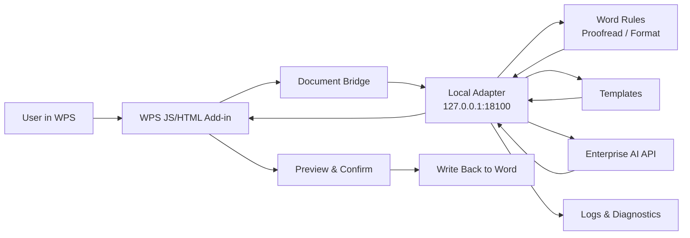

<h1 align="center">AI-WPS</h1>

<p align="center">
  <strong>WPS AI Assistant for Secure Intranet Office Workflows</strong>
  <br />
  A native WPS add-in backed by a local adapter service, enterprise AI providers, and offline delivery tooling.
</p>

<p align="center">
  <a href="./README.md">English</a>
  <span> | </span>
  <a href="./README-ZH.md">Chinese</a>
</p>

<p align="center">
  
  
  
  
</p>

<p align="center">
  
  
  
  
</p>

<p align="center">
  <code>Smart Write</code>
  <code>Smart Imitation</code>
  <code>Document Review</code>
  <code>Format Review</code>
  <code>Excel Analysis</code>
  <code>PPT Smart Summary</code>
  <code>Template Rules</code>
  <code>Runtime Probe</code>
  <code>Offline Delivery</code>
</p>

<br />

<table align="center">
  <tr>
    <td align="center" width="190">
      <strong>WPS Native Add-in</strong>
      <br />
      <sub>Lightweight task pane and document bridge</sub>
    </td>
    <td align="center" width="190">
      <strong>Local Adapter</strong>
      <br />
      <sub>Rules, templates, logs, and diagnostics</sub>
    </td>
    <td align="center" width="190">
      <strong>Enterprise AI</strong>
      <br />
      <sub>Intranet provider integration with mock fallback</sub>
    </td>
    <td align="center" width="190">
      <strong>Offline Delivery</strong>
      <br />
      <sub>Install, start, probe, and acceptance tooling</sub>
    </td>
  </tr>
</table>

---

## Overview

AI-WPS is a WPS AI assistant for intranet office terminals. It uses a **WPS native JS/HTML add-in + local Python adapter service + enterprise AI API** architecture. The add-in stays lightweight, while rules, templates, configuration, logging, diagnostics, and AI orchestration live in the local adapter layer.

The current scope is **Phase 1: platform foundation + Word, Excel, and PPT workflows**, designed for Kylin V10 ARM, offline deployment, and intranet-only environments.

## Current Version

| Item | Value |
| --- | --- |
| Version | `v0.18.1-alpha` |
| Version rule number | `AI-WPS-P1-WORD-EXCEL-PPT-0.18.1-20260715` |
| Phase | `P1` platform foundation + Word + Excel + PPT |
| Runtime target | Kylin V10 ARM, Python 3.8, WPS native JS add-in |
| Delivery status | Internal test build, not final production release |
| Phase 1 delivery kit | One combined Word/Excel/PPT package; release artifact target: `dist-phase1-delivery-kit/ai-wps-phase1-delivery-20260715-v0181.tar.gz` |

Version rule format:

```text
AI-WPS-P{phase}-{scope}-{major.minor.patch}-{yyyymmdd}
```

Rules:

- `phase`: project phase, such as `P1` or `P2`.
- `scope`: main delivery scope, such as `WORD`, `EXCEL`, `PPT`, or `DELIVERY`.
- `major`: architecture or compatibility boundary changes.
- `minor`: user-visible capability additions.
- `patch`: bug fixes, UI polish, packaging updates, and documentation updates.
- `yyyymmdd`: build or milestone date.

## Highlights

| Capability | Description |
| --- | --- |
| WPS native task pane | Manual-import `jsaddons` compatible plugin layout for Kylin/WPS target terminals |
| Host-specific Ribbon entries | Word exposes Smart Write, Smart Imitation, Document Review, Format Review, and Settings; Excel exposes only “智能分析” and Settings; PPT exposes only “智能总结” and Settings |
| Mode-specific task pane | Word, Excel, and PPT use separate host add-ins so their buttons do not cross-display |
| Document review | Uses selected text or a limited full-document extraction path and a dedicated `word.document_review` Dify app to check typos, expression quality, logic, fluency, and document-type professionalism; long-running model-backend requests keep visible task-pane feedback |
| Format review | Checks selected text or the whole document against the standard `技术文件格式及书写要求` template; AI may classify paragraph roles, but the task only reports format issues and does not apply formatting; preview results are grouped, prioritized, and localized for easier troubleshooting |
| Word smart write | Combines rewrite, continue, summarize, and custom writing into one Dify Chatflow task; the adapter sends the full prompt through top-level `query` and automatically supports legacy `inputs.query` workflows |
| Smart imitation | Adds an independent `word.smart_imitation` model workflow for template-based imitation writing with selected-text or pasted templates, required imitation requirements, optional reference material, and preview/plain-text/copy-only results without comparison or writeback |
| Word enterprise knowledge | Stores global terminology and task-scoped writing rules locally for Smart Write, Smart Imitation, and Document Review; provides drill-down CRUD, CSV/XLSX import preview, conflict handling, scoped CSV export, full backup, and explicit degraded-result feedback without changing writeback |
| Excel “智能分析” | Provides a read-only `excel.analysis` model workflow for selected range or active used range analysis; long tasks use background jobs with recoverable polling, with structured report and plain paragraph views and no cell writeback |
| PPT “智能总结” | Uses one `ppt.slide_assistant` workflow profile for two modes. Current-slide summary reads the title, optional subtitle, body text, and adjacent titles. Document summary accepts one UTF-8 `.md` or valid `.docx` file up to 10 MB and produces a complete 5/8/10/12/15-slide recommendation, defaulting to 10 slides. Both modes are preview/copy only and never write to the presentation |
| Result preview | Smart Write first restores paragraph breaks for selected multi-paragraph rewrites, then chooses plain or structured preview based on content: ordinary paragraphs avoid extra formatting, while headings, lists, numbering, tables, and bold text are displayed as structure when present; Document Review, Format Review, and diagnostics continue to use safe Markdown rendering |
| Unified three-host UI | Word, Excel, and PPT share the same restrained light-gray, white, mist-blue, and status-color visual system while preserving host isolation and existing task behavior |
| Template-driven rules | Includes the company template `技术文件格式及书写要求.docx` and its extracted JSON rule profile |
| Local adapter service | FastAPI service with `uvicorn` preferred mode and `standalone` fallback mode |
| Workflow profiles | Smart Write, Smart Imitation, Document Review, Format Review, “智能分析”, and “智能总结” each use a compact host-isolated profile list with name, note, API key, edit, and delete actions; selecting a task-page profile activates it immediately, while both PPT modes share `ppt.slide_assistant` |
| Provider settings | Settings exposes one global API URL plus per-workflow names, notes, and API keys. The legacy unified-key fallback remains adapter-compatible and is preserved during overwrite installation, but is no longer shown in the task pane |
| Adapter operations | Start-kit scripts manage the uvicorn adapter and expose provider configuration, route diagnostics, and last-forwarding diagnostics from health/status/log checks; Kylin V10 targets can install a systemd autostart service |
| Offline delivery | Includes formal plugin kit, adapter start kit, Kylin V10 ARM Python 3.8 wheel bundle, pip bootstrap bundle, and operational scripts |
| Phase 1 delivery kit | One package and one installer deploy the Word, Excel, and PPT add-ins together; overwrite installation preserves the existing API URL, unified API key, and workflow-profile keys, and the package includes Excel/PPT Markdown prompt templates |

## Latest Updates

| Version | Update |
| --- | --- |
| `v0.18.1-alpha` | Streamlines workflow settings across Word, Excel, and PPT: removes unified-key controls from the task pane, keeps a compact host-isolated workflow list with full-width create/edit views, activates task-page selections immediately, protects active profiles from deletion, preserves existing keys when edits leave the key blank, and keeps adapter fallback and overwrite-install compatibility unchanged |
| `v0.18.0-alpha` | Renames the current Excel entry to “智能分析” and upgrades PPT to the dual-mode “智能总结”; adds secure single-file UTF-8 Markdown/DOCX upload, complete-deck 5/8/10/12/15-slide recommendations, 1800-second recoverable polling, a unified three-host visual system, Excel/PPT Markdown prompt templates, and one combined overwrite-install package that preserves the API URL and API keys |
| `v0.17.0-alpha` | Adds the read-only PPT Slide Assistant with current-slide title, optional subtitle, body text, and adjacent-title extraction; generate/optimize modes, recoverable long-task polling, preview/plain-text and categorized copy actions; strict Word/Excel/PPT Ribbon isolation; and one combined upgrade package that preserves the target machine's API URL and API keys |
| `v0.16.0-alpha` | Adds named workflow profiles for all five tasks. Users can pre-save multiple Dify API keys, explicitly switch the active profile from each task pane, and manage names, notes, replacement keys, and inactive profiles in Settings. Existing task keys migrate to a reusable “Current configuration” profile, upgrades preserve all profile keys, and Word/Excel host isolation remains unchanged |
| `v0.15.2-alpha` | Supports both legacy and current Dify Chatflow user inputs: legacy apps keep `inputs.query`, while User Input node apps receive top-level `query` and `files`. When the first request returns HTTP 400, the adapter retries once with the alternate shape and caches the successful mode without changing task prompts, timeouts, parsers, or frontend behavior |
| `v0.15.1-alpha` | Moves Excel Analysis to the same long-running background-job pattern as Document Review: the task pane uses 10-second submit/status requests, persists the client job ID, recovers polling after connection interruptions, and the adapter allows up to 1800 seconds for the model backend |
| `v0.15.0-alpha` | Adds the first Excel workflow, Excel 智能分析, with an Excel-only `et` add-in entry, read-only selected-range or used-range analysis, independent `excel.analysis` model task, structured report and plain paragraph views, and one installer that deploys both Word and Excel add-ins while preserving runtime configuration |
| `v0.13.8-alpha` | Hardens long-running Document Review when model think mode or local connections cross the 180-second range: the task pane now submits a recoverable client job ID, persists the active job locally, uses short status-query timeouts, resumes unfinished jobs after task-pane reload, and keeps low-frequency polling instead of discarding the job after transient adapter connection failures |
| `v0.13.7-alpha` | Improves the Document Review record preview toggle: clicking “Preview review record” now switches to the generated review record, and clicking the same button again returns to the original Document Review result cards while preserving local issue states |
| `v0.13.6-alpha` | Further hardens slow Document Review in model think mode: raises the provider wait budget to 1800 seconds, expands transient status-poll failure tolerance to 240 retries over 60 minutes, and softens polling-stage adapter fetch failures so the task pane keeps waiting instead of presenting a premature connection-failure interpretation |
| `v0.13.5-alpha` | Hardens slow Document Review model-backend waits: raises the Document Review provider budget to 600 seconds, lets task-pane status polling tolerate up to 120 transient query failures over 30 minutes, and changes final feedback to point users to recent task diagnostics instead of reporting an immediate adapter/model connection failure |
| `v0.13.4-alpha` | Fixes Format Review recognition for selected text: the task pane now reads selected `Selection/Range` paragraph formatting before falling back to plain text, unwraps WPS COM scalar values for font size and paragraph alignment, and the adapter treats `0pt` as unknown while normalizing WPS alignment values such as `3` to justified alignment |
| `v0.13.3-alpha` | Improves long-text Document Review in model think mode: the Document Review provider budget is raised to 240 seconds, and task-pane polling now retries transient status-query failures instead of immediately clearing the background job and reporting an adapter connection failure |
| `v0.13.2-alpha` | Stabilizes upgrades and slow model calls: the delivery installer preserves existing target-machine API URL, unified API key, and task-level API keys; Smart Write keeps the 75-second default timeout, Document Review submits a background job and polls for completion while using a longer 150-second provider budget, and Format Review role classification is capped at 60 seconds; task-pane feedback uses user-facing “model backend” wording |
| `v0.13.1-alpha` | Fixes result-experience test issues: Smart Write comparison now highlights changed result text in yellow while preserving headings, lists, tables, and other structure where possible; Document Review now returns readable fallback diagnostics when the model backend times out, is unreachable, or the rich result renderer fails, avoiding blank task-pane results or misleading adapter feedback |
| `v0.13.0-alpha` | Result experience release: integrates Kylin V10 systemd adapter autostart; adds read-only Smart Write result view switching for preview, original/result comparison, and plain text without changing writeback; adds Document Review issue states, copy actions, and generated review records |
| `v0.12.16-alpha` | Improves Format Review result readability: adds a review overview, priority checklist, grouped detail sections, Chinese labels for roles/rules/template/provider/AI fallback diagnostics, and localized values such as font `宋体`, size `小四（12pt）`, style names, alignment, line spacing, and indentation; adds Kylin V10 systemd autostart install/uninstall scripts to the adapter start kit |
| `v0.12.15-alpha` | Stabilizes Document Review in WPS: clicking Review now shows immediate read/submission/wait feedback, uses limited asynchronous extraction instead of blocking full-document scans, and displays raw Dify output when the model returns non-standard JSON or Markdown that cannot be parsed into the normal issue list |
| `v0.12.14-alpha` | Fixes Smart Write output that collapsed two selected paragraphs into one line: the task pane now formats model output before preview and writeback, preserving existing line breaks, restoring likely paragraph breaks from sentence boundaries, and splitting inline Chinese numbering/headings when needed |
| `v0.12.13-alpha` | Improves Smart Write handling for structured selections and structured model output: headings, lists, numbering, tables, and bold text now trigger structured preview and best-effort formatted writeback, while ordinary paragraphs still use plain preview and paragraph-shaped writeback to avoid redundant formatting |
| `v0.12.12-alpha` | Fixes two Smart Write issues in selected-paragraph workflows: the task pane now reads selected text with a lightweight extraction path and defers adapter submission so it no longer scans the whole document before the request; Smart Write previews plain text with preserved line breaks and writes back using the original paragraph shape, while the prompt asks the model to preserve paragraph structure and avoid extra Markdown headings, lists, or tables |
| `v0.12.11-alpha` | Groups Document Review results by typo, expression, logic, fluency, and professionalism; groups Format Review results by page setup, heading, body text, paragraph, caption/note, and other format items; adds a settings-page “recent task diagnostics” panel with sanitized adapter/provider/Dify request summaries; keeps Smart Write, Document Review, Format Review endpoints and task-level API key routing unchanged |
| `v0.12.10-alpha` | Fixed Format Review task-pane freezes before adapter forwarding by limiting WPS paragraph extraction, processing selected text without scanning the whole document, deferring extraction until the status UI renders, and bumping frontend cache tokens for target-machine reloads |
| `v0.12.9-alpha` | Consolidated review modes: replaced Proofread and Technical Review with Document Review (`word.document_review`), changed Smart Format into read-only Format Review (`word.format_review`), removed obsolete word routes, and kept Smart Write plus task-level Dify API key routing intact |
| `v0.12.8-alpha` | Redesigned Word proofreading around local deterministic format checks plus small-batch AI quality review for typo, grammar, expression, logic, and fluency issues; `word.proofread` keeps its independent task API key and Dify workflow |
| `v0.12.7-alpha` | Fixed target-machine HTTP 422 in Smart Write and Smart Format: task pane payloads now sanitize WPS host-object properties before JSON serialization, backend request models tolerate missing `documentId/plainText`, object-shaped style/size values, and WPS underline enums, and validation failures record `request_validation_failed` in `/provider/debug-last` |
| `v0.12.6-alpha` | Continued Smart Format field hardening: paragraph extraction reads `Paragraph.Range.Text`, `Content.Paragraphs`, `Range().Paragraphs`, and full-text fallback splits; no-paragraph, unconfigured-task-key, and unparseable-Dify-output cases are surfaced in the preview and `/provider/debug-last` |
| `v0.12.5-alpha` | Fixed Smart Format reading zero paragraphs in WPS COM-style documents: the task pane supports `Paragraphs.Count`/`Item()` collections, applies format changes through the same collection adapter, and forces Smart Format preview to the whole document scope |
| `v0.12.4-alpha` | Hardened Smart Format Dify role parsing: wrapped `result`/`data`/`outputs` JSON and JSON-array replies are accepted, failed AI role parsing is surfaced in the task pane, and local template fallback remains deterministic |
| `v0.12.3-alpha` | Refined Smart Write for state-owned-enterprise technical solution/reporting use: compact task-pane controls enlarge the Markdown result preview, style/focus/length menus are consolidated, and legacy option values remain compatible in the adapter prompt builder |
| `v0.12.2-alpha` | Fixed Smart Format for long documents by processing every non-empty paragraph in bounded AI-classification batches and reporting coverage statistics; refreshed the task pane and Ribbon artwork with the bright frosted-azure palette |
| `v0.12.1-alpha` | Fixed target panes potentially continuing to load stale plain-text resources: task-pane and static-resource URLs now carry a build token, the diagnostics view exposes the loaded frontend version, and `/provider/debug-last` reports sanitized Markdown feature flags to distinguish Dify output from frontend rendering |
| `v0.12.0-alpha` | Rebuilt Smart Format around the uploaded `技术文件格式及书写要求` Word template: format preview now carries `targetProperties` for page setup, headings, body text, captions, notes, lists, appendices, and table body; settings now support task-level API keys so Smart Format can use its own Dify key while falling back to the unified key when absent |
| `v0.11.8-alpha` | Enhanced the rendered Markdown result preview with preserved paragraphs and single line breaks plus horizontal rules and responsive tables so task-pane output has clearer Dify-like structure |
| `v0.11.7-alpha` | Fixed uvicorn Word routes caching provider settings from adapter startup; after the settings pane saves the API URL, smart write reloads configuration before readiness checks and forwarding instead of continuing to use stale mock-only settings |
| `v0.11.6-alpha` | Adapter start-kit operations now converge on uvicorn; health/status/log scripts expose provider readiness and forwarding diagnostics, and mock fallback records a `/provider/debug-last` skip reason |
| `v0.11.5-alpha` | The task-pane result preview now safely renders Markdown from Dify responses, including headings, lists, quotes, code blocks, and links; copy/apply actions still use the raw model text |
| `v0.11.4-alpha` | Re-aligned `/chat-messages` with official Dify docs: the adapter sends top-level `query` for `sys.query` and mirrors the same prompt into `inputs.query` for a custom Start-node `query`; added sanitized `/provider/debug-last` diagnostics |
| `v0.11.1-alpha` | Tightened task-route key selection so named workflow tasks only use their own `apiKeyRef`, merged default task routes into old target-machine configs, removed the global key status from the settings summary, added route diagnostics, and updated adapter version checks |
| `v0.11.0-alpha` | Replaced separate Rewrite and Continue entries with Smart Write, switched Smart Write to Dify Workflow `/workflows/run` with strict Start variables (`source_text`, `write_action`, `style`, `focus`, `length`, `user_prompt`, `selection_mode`, `trace_id`), removed global API key/probe controls from settings, refreshed Ribbon icons, and added the formal design document as the source of truth for non-bug changes |
| `v0.10.3-alpha` | Refined task-pane prompt visibility: only Rewrite and Continue show prompt-fragment cards, Proofread, Format Preview, and Technical Review return to a cleaner view, and the supplemental input placeholder now starts with “补充要求” |
| `v0.10.2-alpha` | Fixed rewrite/continue Dify Chat inputs: standard `/chat-messages` payload now sends top-level `query` and mirrors `text`, `mode`, `query`, and `prompt` inside `inputs`, preventing workflows from missing the source text or task mode and returning the original text unchanged |
| `v0.10.1-alpha` | Refined the rewrite/continue task pane to expose the exact prompt fragments for style, focus, length, and output constraints; the supplemental input is now presented as a rewrite/continue prompt area while retaining the original free-form placeholder |
| `v0.10.0-alpha` | Upgraded provider routing to one `providerBaseUrl` plus per-task `taskRoutes` with `path`, `apiKeyRef`, and `payloadStyle`; the adapter now routes each Word task directly to its Dify app or workflow, the settings page exposes task key management, and the Dify multi-route deployment guide was added |
| `v0.9.1-alpha` | Fixed stale uvicorn adapters on target machines by replacing old port `18100` processes when the running version does not match the package; merged backend templates with local fallback templates; reduced Technical Document Review to solution, contract acceptance, and test outline document types with type-specific default prompts |
| `v0.8.0-alpha` | Added the sixth Ribbon workflow, Technical Document Review, with document-type selection and a transparent editable review prompt for functional accuracy, terminology, design rationality, and requirement clarity; also enhanced structured proofreading by extracting `documentStructure` and sending document data plus local findings to enterprise Dify User Input |
| `v0.7.1-alpha` | Corrected the Phase 1 delivery package default WPS `jsaddons` install path to `/home/cloud/.local/share/Kingsoft/wps/jsaddons`, updated handoff docs, and rebuilt the delivery package |
| `v0.7.0-alpha` | Added the Phase 1 delivery package with one-click install, pip/runtime offline dependency installation, WPS `jsaddons` deployment, `publish.xml`, one-click smoke test, and acceptance templates |
| `v0.6.9-alpha` | Fixed uvicorn template loading when the adapter starts from `adapter_service/`, restoring `/templates`, Word proofreading, and format preview access to packaged template files |
| `v0.6.8-alpha` | Fixed provider settings clearing: empty model API URLs can now be saved, provider names are saved together with URLs, and provider status is only configured when both API URL and API key are present |
| `v0.6.7-alpha` | Fixed uvicorn startup when an old standalone adapter still owns port `18100`, improved health-check mode hints, replaced raw `Failed to fetch` output with actionable adapter diagnostics, and stabilized single provider URL/API key save feedback |
| `v0.6.6-alpha` | Fixed the Python 3.8 offline dependency bundle by adding `exceptiongroup`, added a uvicorn-only one-click startup guide, added local template dropdown fallback, and reverted settings to a single provider profile |
| `v0.6.5-alpha` | Fixed Ribbon icon fallback rendering, made provider names configurable, and allowed switching the active provider from backend-defined provider profiles |
| `v0.6.4-alpha` | Added provider-card settings with edit drill-down, clarified adapter-not-started mock hints, added Ribbon icon callback fallback, and packaged offline pip bootstrap for Python 3.8 targets without pip |
| `v0.6.3-alpha` | Removed redundant task-pane labels and status text, enlarged the copy action beside result preview, and added configurable enterprise model API URL settings |
| `v0.6.2-alpha` | Refined the task pane into a unified Apple-like clean visual system with light glass cards, subtle hairlines, consistent actions, and result-first spacing |
| `v0.6.1-alpha` | Simplified the settings page and ensured each ribbon action hides the previous task pane before opening the next one |
| `v0.6.0-alpha` | Reworked the WPS AI tab into five task entries, split the task pane into mode-specific Word workflows, localized visible titles, and moved template selection into proofreading and formatting |
| `v0.5.1-alpha` | Added a simple ribbon button icon and moved template selection into settings to keep the home task pane focused |
| `v0.5.0-alpha` | Added company Word template driven proofreading and format preview; added AI typo detection via enterprise provider |
| `v0.4.x-alpha` | Added Kylin V10 ARM offline Python runtime wheel bundle for `uvicorn` mode |
| `v0.3.x-alpha` | Improved task pane interaction: compact home view, settings/diagnostics split, auto scope detection, copy result |
| `v0.2.x-alpha` | Added provider API key UI, selection-only rewrite/continue, and provider mock fallback |
| `v0.1.x-alpha` | Built baseline adapter APIs, proofread, format preview, rewrite, probe kit, and startup scripts |

## Architecture



Design rules:

- AI and formatting results are never written back directly; the user must preview and confirm first.
- The WPS add-in handles UI, document extraction, preview, and write-back. Complex rules and AI orchestration stay in the adapter service.
- Documents are sent as structured payloads, preserving paragraphs, headings, font names, font sizes, alignment, and outline levels.

## Repository Map

| Path | Purpose |
| --- | --- |
| `wps-addon/` | WPS add-in source, built with Vite and TypeScript |
| `adapter_service/` | Local Python adapter service with FastAPI APIs, Word services, provider client, and tests |
| `templates/` | Office templates and proofreading rule configuration |
| `config/` | Runtime adapter configuration examples |
| `packaging/` | Offline install, start, diagnose, uninstall, and package build scripts |
| `formal-plugin-kit/` | Manual import kit for the formal WPS add-in |
| `probe-kit/` | Runtime probe kit for target machines |
| `adapter-start-kit/` | Operator-friendly adapter startup kit |
| `docs/` | Design, deployment, acceptance, and operation notes |
| `jsaddons/` | WPS add-in import/publish artifacts and validation materials |

## Quick Start

### 1. Start the local adapter

```bash
cd adapter_service
python -m venv .venv
source .venv/bin/activate
pip install -r requirements.txt
uvicorn app.main:app --host 127.0.0.1 --port 18100
```

For Windows PowerShell:

```powershell
cd adapter_service
python -m venv .venv
.\.venv\Scripts\Activate.ps1
pip install -r requirements.txt
uvicorn app.main:app --host 127.0.0.1 --port 18100
```

Health check:

```bash
curl http://127.0.0.1:18100/health
```

If FastAPI dependencies are inconvenient in the target environment, use the built-in lightweight standalone server:

```bash
python adapter_service/standalone_adapter.py 18100
```

### 2. Build the WPS add-in frontend

```bash
cd wps-addon
npm install
npm run test
npm run build
```

The frontend build output goes to `wps-addon/dist/`. For formal intranet terminals, prefer the curated manual import layout under `formal-plugin-kit/`.

### 3. Configure the enterprise AI provider

Copy the example config:

```bash
cp config/adapter.example.json config/adapter.json
```

Important fields:

```json
{
  "servicePort": 18100,
  "providerName": "Enterprise Model API",
  "providerType": "enterprise-dify-chat",
  "providerBaseUrl": "",
  "providerApiKeyEnv": "ENTERPRISE_AI_API_KEY",
  "providerChatPath": "/chat-messages",
  "providerMode": "blocking",
  "logPath": "./logs/adapter.log",
  "templateRoot": "./templates",
  "timeoutSeconds": 75,
  "taskApiKeyRefs": {
    "word.smart_write": "word_smart_write",
    "word.smart_imitation": "word_smart_imitation",
    "word.document_review": "word_document_review",
    "word.format_review": "word_format_review",
    "excel.analysis": "excel_analysis",
    "ppt.slide_assistant": "ppt_slide_assistant"
  }
}
```

Use an environment variable for the API key:

```bash
export ENTERPRISE_AI_API_KEY="your-api-key"
```

Workflow-profile API keys are stored under `run/provider_api_keys/<ref>` while `adapter.json` keeps only display metadata and key references. Smart Write, Smart Imitation, Document Review, Format Review, “智能分析”, and “智能总结” can each keep multiple Dify app keys; activation affects the next new task and missing task keys fall back to the unified provider key. PPT current-slide and document modes use the same resolved `ppt.slide_assistant` key for Dify `/files/upload` and `/chat-messages`. See the [workflow profile operations guide](./docs/operations/workflow-profile-management.md).

The Smart Write Dify system prompt, structure-preserving response rules, and verification flow are documented in the [Smart Write Dify workflow guide](./docs/operations/dify-smart-write-workflow.md). Smart Imitation setup is documented in the [Smart Imitation Dify workflow guide](./docs/operations/dify-smart-imitation-workflow.md). Document Review setup is documented in the [Document Review Dify workflow guide](./docs/operations/dify-document-review-workflow.md). Format Review setup is documented in the [Format Review Dify workflow guide](./docs/operations/dify-format-review-workflow.md). Word terminology/rule maintenance, imports, exports, backup, degraded behavior, and recovery are documented in the [enterprise knowledge operations guide](./docs/operations/enterprise-knowledge-management.md). “智能分析” setup is documented in the [Excel analysis Dify workflow guide](./docs/operations/dify-excel-analysis-workflow.md), and the two PPT “智能总结” modes are documented in the [PPT smart summary Dify workflow guide](./docs/operations/dify-ppt-slide-assistant-workflow.md). Deployable prompt templates are available under [`docs/prompt-templates/`](./docs/prompt-templates/).

## API Surface

| Method | Path | Purpose |
| --- | --- | --- |
| `GET` | `/health` | Adapter health, version, and provider configuration status |
| `GET` | `/config` | Current runtime configuration summary |
| `GET` | `/templates` | Available template list |
| `GET` | `/provider/status` | Enterprise AI provider authentication status |
| `GET` | `/provider/task-api-keys` | Task-level API key status summary |
| `GET` | `/provider/workflow-profiles` | Named profiles and active selection for one task |
| `POST` | `/provider/workflow-profiles` | Create a named workflow profile |
| `PATCH` | `/provider/workflow-profiles/{profileId}` | Rename a profile or update its note |
| `POST` | `/provider/workflow-profiles/{profileId}/api-key` | Replace one profile API key |
| `POST` | `/provider/workflow-profiles/{profileId}/activate` | Activate a profile for its task |
| `DELETE` | `/provider/workflow-profiles/{profileId}` | Delete an inactive profile |
| `POST` | `/provider/api-key` | Save the unified Dify Chat API key |
| `DELETE` | `/provider/api-key` | Clear the unified Dify Chat API key |
| `POST` | `/provider/task-api-key` | Save a dedicated Dify API key for one task |
| `DELETE` | `/provider/task-api-key/{taskType}` | Clear a dedicated Dify API key for one task |
| `POST` | `/word/smart-write` | Smart Write for rewrite, continue, summarize, or custom writing from the current selection |
| `POST` | `/word/smart-imitation` | Preview/copy-only imitation writing from a template, requirements, and optional reference material |
| `POST` | `/word/document-review` | Document review for typos, expression, logic, fluency, and document-type professionalism |
| `POST` | `/word/document-review/jobs` | Start a background Document Review job for slow model-backend responses |
| `GET` | `/word/document-review/jobs/{jobId}` | Poll a background Document Review job until it completes or fails |
| `POST` | `/word/format-review` | Read-only format compliance review against the standard template |
| `POST` | `/excel/analysis` | Read-only analysis of the selected range or active worksheet used range |
| `POST` | `/excel/analysis/jobs` | Start a recoverable background “智能分析” job |
| `GET` | `/excel/analysis/jobs/{jobId}` | Poll a background “智能分析” job |
| `POST` | `/ppt/document-files` | Validate and stage one UTF-8 `.md` or valid `.docx` source file up to 10 MB behind a one-time token |
| `POST` | `/ppt/slide-assistant/jobs` | Start a current-slide or document “智能总结” background job |
| `GET` | `/ppt/slide-assistant/jobs/{jobId}` | Poll or resume a background “智能总结” job |

Unified response envelope:

```json
{
  "success": true,
  "traceId": "word-document-review-...",
  "taskType": "word.document_review",
  "message": "completed",
  "data": {},
  "errors": []
}
```

## Offline Delivery

The formal Phase 1 release is a single combined Word/Excel/PPT package with one installer. An overwrite installation keeps the target machine's existing `config/adapter.json`, unified API key, `run/provider_api_keys/`, Word enterprise knowledge database, and up to three existing knowledge backups; the package also carries the Excel/PPT Markdown prompt templates and generated enterprise-knowledge CSV/XLSX import templates.

Build the full offline bundle:

```bash
bash packaging/build_offline_bundle.sh
```

Default output:

```text
dist-offline/wps-ai-assistant-offline.tar.gz
```

Install to a target directory:

```bash
bash packaging/install.sh "$HOME/.wps-ai-assistant"
```

Start the adapter:

```bash
bash packaging/start_adapter.sh "$HOME/.wps-ai-assistant" 18100
```

Diagnose:

```bash
bash packaging/diagnose.sh "$HOME/.wps-ai-assistant"
```

Uninstall:

```bash
bash packaging/uninstall.sh "$HOME/.wps-ai-assistant"
```

Additional delivery kits:

| Command | Output Purpose |
| --- | --- |
| `bash packaging/build_formal_plugin_kit.sh` | Formal WPS add-in manual import kit |
| `bash packaging/build_probe_kit.sh` | Runtime probe kit for target machines |
| `bash packaging/build_adapter_start_kit.sh` | Manual adapter startup kit |

## Tests

Backend:

```bash
cd adapter_service
pytest
```

Frontend:

```bash
cd wps-addon
npm run test
```

## Status & Roadmap

The current implementation covers the Phase 1 baseline:

- WPS task pane and action buttons
- Structured document/selection extraction
- Local adapter health, config, templates, and provider status
- Smart Write, Document Review, and Format Review APIs
- Read-only Excel “智能分析” and dual-mode PPT “智能总结”
- Preview-first Word write-back
- Runtime probing and offline delivery scripts

Phase 2 can extend the same adapter foundation with:

- Richer Excel report generation and multi-sheet workflows
- Excel multi-sheet and multi-file comparison
- Governed PPT generation workflows beyond the current preview/copy-only summary boundary
- Richer enterprise templates, audit, permissions, and knowledge-base governance
