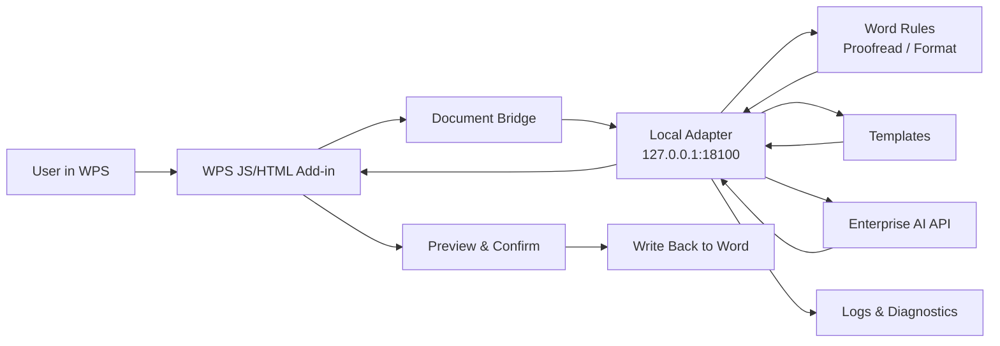

<h1 align="center">AI-WPS</h1>

<p align="center">
  <strong>WPS AI Assistant for Secure Intranet Office Workflows</strong>
  <br />
  A native WPS add-in backed by a local adapter service, enterprise AI providers, and offline delivery tooling.
</p>

<p align="center">
  <a href="./README.md">English</a>
  <span> | </span>
  <a href="./README-ZH.md">Chinese</a>
</p>

<p align="center">
  
  
  
  
</p>

<p align="center">
  
  
  
  
</p>

<p align="center">
  <code>Smart Write</code>
  <code>Document Review</code>
  <code>Format Review</code>
  <code>Template Rules</code>
  <code>Runtime Probe</code>
  <code>Offline Delivery</code>
</p>

<br />

<table align="center">
  <tr>
    <td align="center" width="190">
      <strong>WPS Native Add-in</strong>
      <br />
      <sub>Lightweight task pane and document bridge</sub>
    </td>
    <td align="center" width="190">
      <strong>Local Adapter</strong>
      <br />
      <sub>Rules, templates, logs, and diagnostics</sub>
    </td>
    <td align="center" width="190">
      <strong>Enterprise AI</strong>
      <br />
      <sub>Intranet provider integration with mock fallback</sub>
    </td>
    <td align="center" width="190">
      <strong>Offline Delivery</strong>
      <br />
      <sub>Install, start, probe, and acceptance tooling</sub>
    </td>
  </tr>
</table>

---

## Overview

AI-WPS is a WPS AI assistant for intranet office terminals. It uses a **WPS native JS/HTML add-in + local Python adapter service + enterprise AI API** architecture. The add-in stays lightweight, while rules, templates, configuration, logging, diagnostics, and AI orchestration live in the local adapter layer.

The current scope is **Phase 1: platform foundation + Word workflows**, designed for Kylin V10 ARM, offline deployment, and intranet-only environments.

## Current Version

| Item | Value |
| --- | --- |
| Version | `v0.12.9-alpha` |
| Version rule number | `AI-WPS-P1-WORD-0.12.9-20260529` |
| Phase | `P1` platform foundation + Word |
| Runtime target | Kylin V10 ARM, Python 3.8, WPS native JS add-in |
| Delivery status | Internal test build, not final production release |
| Phase 1 delivery kit | `dist-phase1-delivery-kit/ai-wps-phase1-delivery-20260529.tar.gz` |

Version rule format:

```text
AI-WPS-P{phase}-{scope}-{major.minor.patch}-{yyyymmdd}
```

Rules:

- `phase`: project phase, such as `P1` or `P2`.
- `scope`: main delivery scope, such as `WORD`, `EXCEL`, `PPT`, or `DELIVERY`.
- `major`: architecture or compatibility boundary changes.
- `minor`: user-visible capability additions.
- `patch`: bug fixes, UI polish, packaging updates, and documentation updates.
- `yyyymmdd`: build or milestone date.

## Highlights

| Capability | Description |
| --- | --- |
| WPS native task pane | Manual-import `jsaddons` compatible plugin layout for Kylin/WPS target terminals |
| Four task entries | WPS AI tab exposes Smart Write, Document Review, Format Review, and Settings as focused ribbon actions |
| Mode-specific task pane | One task pane switches into focused Word workflows based on the clicked ribbon action |
| Document review | Uses selected text or the whole document and a dedicated `word.document_review` Dify app to check typos, expression quality, logic, fluency, and document-type professionalism |
| Format review | Checks selected text or the whole document against the standard `技术文件格式及书写要求` template; AI may classify paragraph roles, but the task only reports format issues and does not apply formatting |
| Word smart write | Combines rewrite, continue, summarize, and custom writing into one Dify Chatflow task; the adapter sends the full prompt through both top-level `query` and `inputs.query` |
| Markdown result preview | The task pane renders Markdown paragraphs, line breaks, headings, lists, tables, quotes, code blocks, and links while copy/apply actions keep the raw model text |
| Frosted azure UI | The task pane and Ribbon icon artwork use a bright blue-gray and white Apple-like palette without changing task flow or API behavior |
| Template-driven rules | Includes the company template `技术文件格式及书写要求.docx` and its extracted JSON rule profile |
| Local adapter service | FastAPI service with `uvicorn` preferred mode and `standalone` fallback mode |
| Provider settings | Settings page keeps one global API URL and supports both a unified Dify Chat API key and task-level API keys; task keys override the unified fallback only for their own task |
| Adapter operations | Start-kit scripts manage the uvicorn adapter and expose provider configuration, route diagnostics, and last-forwarding diagnostics from health/status/log checks |
| Offline delivery | Includes formal plugin kit, adapter start kit, Kylin V10 ARM Python 3.8 wheel bundle, pip bootstrap bundle, and operational scripts |
| Phase 1 delivery kit | One package installs WPS add-in files, `publish.xml`, pip bootstrap, runtime wheels, adapter service, smoke-test scripts, and acceptance templates |

## Latest Updates

| Version | Update |
| --- | --- |
| `v0.12.9-alpha` | Consolidated review modes: replaced Proofread and Technical Review with Document Review (`word.document_review`), changed Smart Format into read-only Format Review (`word.format_review`), removed obsolete word routes, and kept Smart Write plus task-level Dify API key routing intact |
| `v0.12.8-alpha` | Redesigned Word proofreading around local deterministic format checks plus small-batch AI quality review for typo, grammar, expression, logic, and fluency issues; `word.proofread` keeps its independent task API key and Dify workflow |
| `v0.12.7-alpha` | Fixed target-machine HTTP 422 in Smart Write and Smart Format: task pane payloads now sanitize WPS host-object properties before JSON serialization, backend request models tolerate missing `documentId/plainText`, object-shaped style/size values, and WPS underline enums, and validation failures record `request_validation_failed` in `/provider/debug-last` |
| `v0.12.6-alpha` | Continued Smart Format field hardening: paragraph extraction reads `Paragraph.Range.Text`, `Content.Paragraphs`, `Range().Paragraphs`, and full-text fallback splits; no-paragraph, unconfigured-task-key, and unparseable-Dify-output cases are surfaced in the preview and `/provider/debug-last` |
| `v0.12.5-alpha` | Fixed Smart Format reading zero paragraphs in WPS COM-style documents: the task pane supports `Paragraphs.Count`/`Item()` collections, applies format changes through the same collection adapter, and forces Smart Format preview to the whole document scope |
| `v0.12.4-alpha` | Hardened Smart Format Dify role parsing: wrapped `result`/`data`/`outputs` JSON and JSON-array replies are accepted, failed AI role parsing is surfaced in the task pane, and local template fallback remains deterministic |
| `v0.12.3-alpha` | Refined Smart Write for state-owned-enterprise technical solution/reporting use: compact task-pane controls enlarge the Markdown result preview, style/focus/length menus are consolidated, and legacy option values remain compatible in the adapter prompt builder |
| `v0.12.2-alpha` | Fixed Smart Format for long documents by processing every non-empty paragraph in bounded AI-classification batches and reporting coverage statistics; refreshed the task pane and Ribbon artwork with the bright frosted-azure palette |
| `v0.12.1-alpha` | Fixed target panes potentially continuing to load stale plain-text resources: task-pane and static-resource URLs now carry a build token, the diagnostics view exposes the loaded frontend version, and `/provider/debug-last` reports sanitized Markdown feature flags to distinguish Dify output from frontend rendering |
| `v0.12.0-alpha` | Rebuilt Smart Format around the uploaded `技术文件格式及书写要求` Word template: format preview now carries `targetProperties` for page setup, headings, body text, captions, notes, lists, appendices, and table body; settings now support task-level API keys so Smart Format can use its own Dify key while falling back to the unified key when absent |
| `v0.11.8-alpha` | Enhanced the rendered Markdown result preview with preserved paragraphs and single line breaks plus horizontal rules and responsive tables so task-pane output has clearer Dify-like structure |
| `v0.11.7-alpha` | Fixed uvicorn Word routes caching provider settings from adapter startup; after the settings pane saves the API URL, smart write reloads configuration before readiness checks and forwarding instead of continuing to use stale mock-only settings |
| `v0.11.6-alpha` | Adapter start-kit operations now converge on uvicorn; health/status/log scripts expose provider readiness and forwarding diagnostics, and mock fallback records a `/provider/debug-last` skip reason |
| `v0.11.5-alpha` | The task-pane result preview now safely renders Markdown from Dify responses, including headings, lists, quotes, code blocks, and links; copy/apply actions still use the raw model text |
| `v0.11.4-alpha` | Re-aligned `/chat-messages` with official Dify docs: the adapter sends top-level `query` for `sys.query` and mirrors the same prompt into `inputs.query` for a custom Start-node `query`; added sanitized `/provider/debug-last` diagnostics |
| `v0.11.1-alpha` | Tightened task-route key selection so named workflow tasks only use their own `apiKeyRef`, merged default task routes into old target-machine configs, removed the global key status from the settings summary, added route diagnostics, and updated adapter version checks |
| `v0.11.0-alpha` | Replaced separate Rewrite and Continue entries with Smart Write, switched Smart Write to Dify Workflow `/workflows/run` with strict Start variables (`source_text`, `write_action`, `style`, `focus`, `length`, `user_prompt`, `selection_mode`, `trace_id`), removed global API key/probe controls from settings, refreshed Ribbon icons, and added the formal design document as the source of truth for non-bug changes |
| `v0.10.3-alpha` | Refined task-pane prompt visibility: only Rewrite and Continue show prompt-fragment cards, Proofread, Format Preview, and Technical Review return to a cleaner view, and the supplemental input placeholder now starts with “补充要求” |
| `v0.10.2-alpha` | Fixed rewrite/continue Dify Chat inputs: standard `/chat-messages` payload now sends top-level `query` and mirrors `text`, `mode`, `query`, and `prompt` inside `inputs`, preventing workflows from missing the source text or task mode and returning the original text unchanged |
| `v0.10.1-alpha` | Refined the rewrite/continue task pane to expose the exact prompt fragments for style, focus, length, and output constraints; the supplemental input is now presented as a rewrite/continue prompt area while retaining the original free-form placeholder |
| `v0.10.0-alpha` | Upgraded provider routing to one `providerBaseUrl` plus per-task `taskRoutes` with `path`, `apiKeyRef`, and `payloadStyle`; the adapter now routes each Word task directly to its Dify app or workflow, the settings page exposes task key management, and the Dify multi-route deployment guide was added |
| `v0.9.1-alpha` | Fixed stale uvicorn adapters on target machines by replacing old port `18100` processes when the running version does not match the package; merged backend templates with local fallback templates; reduced Technical Document Review to solution, contract acceptance, and test outline document types with type-specific default prompts |
| `v0.8.0-alpha` | Added the sixth Ribbon workflow, Technical Document Review, with document-type selection and a transparent editable review prompt for functional accuracy, terminology, design rationality, and requirement clarity; also enhanced structured proofreading by extracting `documentStructure` and sending document data plus local findings to enterprise Dify User Input |
| `v0.7.1-alpha` | Corrected the Phase 1 delivery package default WPS `jsaddons` install path to `/home/cloud/.local/share/Kingsoft/wps/jsaddons`, updated handoff docs, and rebuilt the delivery package |
| `v0.7.0-alpha` | Added the Phase 1 delivery package with one-click install, pip/runtime offline dependency installation, WPS `jsaddons` deployment, `publish.xml`, one-click smoke test, and acceptance templates |
| `v0.6.9-alpha` | Fixed uvicorn template loading when the adapter starts from `adapter_service/`, restoring `/templates`, Word proofreading, and format preview access to packaged template files |
| `v0.6.8-alpha` | Fixed provider settings clearing: empty model API URLs can now be saved, provider names are saved together with URLs, and provider status is only configured when both API URL and API key are present |
| `v0.6.7-alpha` | Fixed uvicorn startup when an old standalone adapter still owns port `18100`, improved health-check mode hints, replaced raw `Failed to fetch` output with actionable adapter diagnostics, and stabilized single provider URL/API key save feedback |
| `v0.6.6-alpha` | Fixed the Python 3.8 offline dependency bundle by adding `exceptiongroup`, added a uvicorn-only one-click startup guide, added local template dropdown fallback, and reverted settings to a single provider profile |
| `v0.6.5-alpha` | Fixed Ribbon icon fallback rendering, made provider names configurable, and allowed switching the active provider from backend-defined provider profiles |
| `v0.6.4-alpha` | Added provider-card settings with edit drill-down, clarified adapter-not-started mock hints, added Ribbon icon callback fallback, and packaged offline pip bootstrap for Python 3.8 targets without pip |
| `v0.6.3-alpha` | Removed redundant task-pane labels and status text, enlarged the copy action beside result preview, and added configurable enterprise model API URL settings |
| `v0.6.2-alpha` | Refined the task pane into a unified Apple-like clean visual system with light glass cards, subtle hairlines, consistent actions, and result-first spacing |
| `v0.6.1-alpha` | Simplified the settings page and ensured each ribbon action hides the previous task pane before opening the next one |
| `v0.6.0-alpha` | Reworked the WPS AI tab into five task entries, split the task pane into mode-specific Word workflows, localized visible titles, and moved template selection into proofreading and formatting |
| `v0.5.1-alpha` | Added a simple ribbon button icon and moved template selection into settings to keep the home task pane focused |
| `v0.5.0-alpha` | Added company Word template driven proofreading and format preview; added AI typo detection via enterprise provider |
| `v0.4.x-alpha` | Added Kylin V10 ARM offline Python runtime wheel bundle for `uvicorn` mode |
| `v0.3.x-alpha` | Improved task pane interaction: compact home view, settings/diagnostics split, auto scope detection, copy result |
| `v0.2.x-alpha` | Added provider API key UI, selection-only rewrite/continue, and provider mock fallback |
| `v0.1.x-alpha` | Built baseline adapter APIs, proofread, format preview, rewrite, probe kit, and startup scripts |

## Architecture



Design rules:

- AI and formatting results are never written back directly; the user must preview and confirm first.
- The WPS add-in handles UI, document extraction, preview, and write-back. Complex rules and AI orchestration stay in the adapter service.
- Documents are sent as structured payloads, preserving paragraphs, headings, font names, font sizes, alignment, and outline levels.

## Repository Map

| Path | Purpose |
| --- | --- |
| `wps-addon/` | WPS add-in source, built with Vite and TypeScript |
| `adapter_service/` | Local Python adapter service with FastAPI APIs, Word services, provider client, and tests |
| `templates/` | Office templates and proofreading rule configuration |
| `config/` | Runtime adapter configuration examples |
| `packaging/` | Offline install, start, diagnose, uninstall, and package build scripts |
| `formal-plugin-kit/` | Manual import kit for the formal WPS add-in |
| `probe-kit/` | Runtime probe kit for target machines |
| `adapter-start-kit/` | Operator-friendly adapter startup kit |
| `docs/` | Design, deployment, acceptance, and operation notes |
| `jsaddons/` | WPS add-in import/publish artifacts and validation materials |

## Quick Start

### 1. Start the local adapter

```bash
cd adapter_service
python -m venv .venv
source .venv/bin/activate
pip install -r requirements.txt
uvicorn app.main:app --host 127.0.0.1 --port 18100
```

For Windows PowerShell:

```powershell
cd adapter_service
python -m venv .venv
.\.venv\Scripts\Activate.ps1
pip install -r requirements.txt
uvicorn app.main:app --host 127.0.0.1 --port 18100
```

Health check:

```bash
curl http://127.0.0.1:18100/health
```

If FastAPI dependencies are inconvenient in the target environment, use the built-in lightweight standalone server:

```bash
python adapter_service/standalone_adapter.py 18100
```

### 2. Build the WPS add-in frontend

```bash
cd wps-addon
npm install
npm run test
npm run build
```

The frontend build output goes to `wps-addon/dist/`. For formal intranet terminals, prefer the curated manual import layout under `formal-plugin-kit/`.

### 3. Configure the enterprise AI provider

Copy the example config:

```bash
cp config/adapter.example.json config/adapter.json
```

Important fields:

```json
{
  "servicePort": 18100,
  "providerName": "Enterprise Model API",
  "providerType": "enterprise-dify-chat",
  "providerBaseUrl": "",
  "providerApiKeyEnv": "ENTERPRISE_AI_API_KEY",
  "providerChatPath": "/chat-messages",
  "providerMode": "blocking",
  "logPath": "./logs/adapter.log",
  "templateRoot": "./templates",
  "timeoutSeconds": 30,
  "taskApiKeyRefs": {
    "word.smart_write": "word_smart_write",
    "word.document_review": "word_document_review",
    "word.format_review": "word_format_review"
  }
}
```

Use an environment variable for the API key:

```bash
export ENTERPRISE_AI_API_KEY="your-api-key"
```

Task-level API keys are stored under `run/provider_api_keys/<ref>`. Smart Write, Document Review, and Format Review can each use a dedicated Dify app key; when a task key is absent, the adapter falls back to the unified provider API key. When no usable key is configured, `/word/smart-write` returns a local mock response and Format Review still performs local template-rule checks.

The Smart Write Dify system prompt, Markdown response requirements, and verification flow are documented in the [Smart Write Dify workflow guide](./docs/operations/dify-smart-write-workflow.md). Document Review setup is documented in the [Document Review Dify workflow guide](./docs/operations/dify-document-review-workflow.md). Format Review setup is documented in the [Format Review Dify workflow guide](./docs/operations/dify-format-review-workflow.md).

## API Surface

| Method | Path | Purpose |
| --- | --- | --- |
| `GET` | `/health` | Adapter health, version, and provider configuration status |
| `GET` | `/config` | Current runtime configuration summary |
| `GET` | `/templates` | Available template list |
| `GET` | `/provider/status` | Enterprise AI provider authentication status |
| `GET` | `/provider/task-api-keys` | Task-level API key status summary |
| `POST` | `/provider/api-key` | Save the unified Dify Chat API key |
| `DELETE` | `/provider/api-key` | Clear the unified Dify Chat API key |
| `POST` | `/provider/task-api-key` | Save a dedicated Dify API key for one task |
| `DELETE` | `/provider/task-api-key/{taskType}` | Clear a dedicated Dify API key for one task |
| `POST` | `/word/smart-write` | Smart Write for rewrite, continue, summarize, or custom writing from the current selection |
| `POST` | `/word/document-review` | Document review for typos, expression, logic, fluency, and document-type professionalism |
| `POST` | `/word/format-review` | Read-only format compliance review against the standard template |

Unified response envelope:

```json
{
  "success": true,
  "traceId": "word-document-review-...",
  "taskType": "word.document_review",
  "message": "completed",
  "data": {},
  "errors": []
}
```

## Offline Delivery

Build the full offline bundle:

```bash
bash packaging/build_offline_bundle.sh
```

Default output:

```text
dist-offline/wps-ai-assistant-offline.tar.gz
```

Install to a target directory:

```bash
bash packaging/install.sh "$HOME/.wps-ai-assistant"
```

Start the adapter:

```bash
bash packaging/start_adapter.sh "$HOME/.wps-ai-assistant" 18100
```

Diagnose:

```bash
bash packaging/diagnose.sh "$HOME/.wps-ai-assistant"
```

Uninstall:

```bash
bash packaging/uninstall.sh "$HOME/.wps-ai-assistant"
```

Additional delivery kits:

| Command | Output Purpose |
| --- | --- |
| `bash packaging/build_formal_plugin_kit.sh` | Formal WPS add-in manual import kit |
| `bash packaging/build_probe_kit.sh` | Runtime probe kit for target machines |
| `bash packaging/build_adapter_start_kit.sh` | Manual adapter startup kit |

## Tests

Backend:

```bash
cd adapter_service
pytest
```

Frontend:

```bash
cd wps-addon
npm run test
```

## Status & Roadmap

The current implementation covers the Phase 1 baseline:

- WPS task pane and action buttons
- Structured document/selection extraction
- Local adapter health, config, templates, and provider status
- Smart Write, Document Review, and Format Review APIs
- Preview-first Word write-back
- Runtime probing and offline delivery scripts

Phase 2 can extend the same adapter foundation with:

- Excel report generation
- Excel multi-sheet and multi-file comparison
- PPT outline generation
- Richer enterprise templates, audit, permissions, and knowledge-base governance
