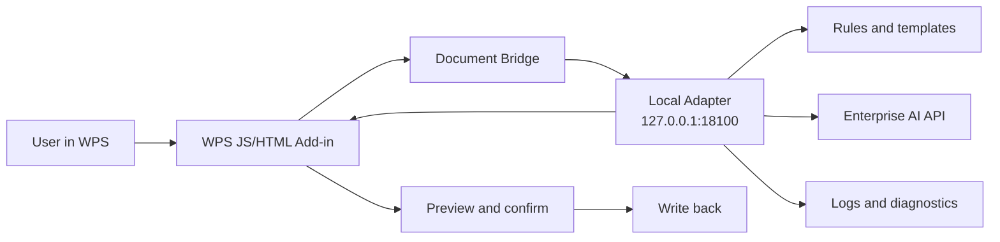

# AI-WPS

A WPS AI assistant for intranet office terminals. Architecture: **native WPS JS/HTML add-in + local Python adapter + enterprise AI API**. The add-in owns UI, document extraction, preview, and write-back. Rules, templates, configuration, logs, diagnostics, and model calls stay in the local adapter.

Current scope is **Phase 1: platform foundation + Word / Excel / PPT**, targeting Kylin V10 ARM, Python 3.8, and offline install.

[English](./README.md) | [Chinese](./README-ZH.md)

Product page: [English](https://w4yne00.github.io/AI-WPS/en.html) · [中文](https://w4yne00.github.io/AI-WPS/)

## Current Version

| Item | Value |
| --- | --- |
| Version | `v0.25.3-alpha` |
| Version rule number | `AI-WPS-P1-WORD-EXCEL-PPT-0.25.3` |
| Phase | `P1` platform foundation + Word + Excel + PPT |
| Runtime target | Kylin V10 ARM, Python 3.8, WPS native JS add-in |
| Delivery status | 0.25.3 automated candidate `20260826-d1a346b` (`candidate`); Issue #59 remains `manual-pending` |
| Phase 1 delivery kit | `ai-wps-phase1-delivery-20260826-d1a346b-v0253.tar.gz`, SHA-256 `120a2cfd8decd956224c3702721d85846bdaecf91d71b87b31c0f7be1b258cb7`; source `d1a346b0d7e1301f74b37e692664fd31085ee050` |

`v0.25.3-alpha` keeps the Phase1 installer and adds 结果预览, 格式问题 cards, 题注关联结论, and 幻灯片页角色. 图像语义补充 stays default-on; probe failure or a closed master switch is 视觉关闭降级. Automated gates still yield only `candidate`.

Version rule: `AI-WPS-P{phase}-{scope}-{major.minor.patch}-{yyyymmdd}`. Major is a compatibility boundary, minor is user-visible capability, patch covers fixes, UI, packaging, and docs.

## What's new

| Version | Summary |
| --- | --- |
| `v0.25.3-alpha` | Result preview; format-issue cards; caption-association conclusions; slide page roles |
| `v0.25.2-alpha` | Image-semantics supplement default-on with visual-off degrade; PPT Chinese template title recognition |
| `v0.25.1-alpha` | Format-review v2 JS/Python hash contract; allowlist assembly; Python 3.8 lifecycle gate |
| `v0.25.0-alpha` | Deterministic format review and restricted semantics DSL; image semantics shipped dormant |

Frozen kits: `v0.25.2-alpha` candidate `20260825-850871c` (SHA-256 `c5d663d1249147104bee66790fea60f5e15675418a51c0c1a7a0fc028a285a92`); `v0.25.1-alpha` candidate `20260824-d7a1dd8` (SHA-256 `ec318db4ffbda499c24aa6fb50958628cc4eaa030b22389bbf29cd783b1adbf6`). Rejected predecessors, gate numbers, and lineage live in [packaging/v0253-delivery.md](./packaging/v0253-delivery.md), [packaging/v0252-delivery.md](./packaging/v0252-delivery.md), and [packaging/v0251-delivery.md](./packaging/v0251-delivery.md).

## Features

Word, Excel, and PPT ship as separate add-ins so Ribbon buttons never cross-display. Model output is previewed before any write-back. Review and analysis tasks are read-only by default.

| Host | Entry | Notes |
| --- | --- | --- |
| Word | Smart Write | Rewrite, continue, summarize, custom write; preview / compare / plain text, then write-back |
| Word | Smart Imitation | Template-based imitation; preview, plain text, copy; no write-back |
| Word | Document Review | Typos, expression, logic, fluency, professionalism; selection or limited full document |
| Word | Format Review | Against `技术文件格式及书写要求`; 格式问题 cards, 题注关联结论, 图像语义补充; no format write-back |
| Word | Writing policy | Four preset packs plus a local organization library |
| Excel | 智能分析 | Selected or used range; structured report and briefing paragraph; no cell writes |
| Excel | 公式助手 | Explicit selection (max 30×20); generate or explain; copy only |
| PPT | 智能总结 | Current slide, or one `.md` / `.docx` (≤10 MB) for a full-deck outline; preview and copy only |
| PPT | 结构审查 | Up to 60 slides; 幻灯片页角色 list; read-only |

The local adapter (default `127.0.0.1:18100`) stores per-task model configurations. Workflow-platform access uses `/chat-messages`; direct-model access uses OpenAI-compatible `/chat/completions`. Runtime requests do not fall back to a unified URL or key. Production mock output stays off unless explicitly enabled.

## Architecture


```mermaid
flowchart LR
  User[User in WPS] --> Addin[WPS JS/HTML Add-in]
  Addin --> Bridge[Document Bridge]
  Bridge --> Adapter[Local Adapter<br/>127.0.0.1:18100]
  Adapter --> Rules[Rules and templates]
  Adapter --> Provider[Enterprise AI API]
  Adapter --> Logs[Logs and diagnostics]
  Adapter --> Addin
  Addin --> Preview[Preview and confirm]
  Preview --> WPS[Write back]
```

- The add-in handles UI, extraction, preview, and write-back.
- Documents travel as structured payloads (paragraphs, headings, fonts, sizes, alignment, outline levels).
- Health distinguishes live, ready, degraded, and recovery. Recovery blocks config changes and new model jobs.

## Repository Map

| Path | Purpose |
| --- | --- |
| `wps-addon/` | Add-in source (Vite + TypeScript) |
| `adapter_service/` | Local adapter (FastAPI, rules, provider, tests) |
| `formal-plugin-kit/` | Formal WPS manual-import kit |
| `templates/` | Office templates and review rules |
| `config/` | Runtime config examples |
| `packaging/` | Offline install, diagnostics, kit build |
| `phase1-delivery-kit/` | Phase 1 installer and acceptance materials |
| `adapter-start-kit/` | Manual adapter startup kit |
| `probe-kit/` | Target-machine runtime probe |
| `docs/` | Design, operations, acceptance |
| `jsaddons/` | WPS import / publish materials |

## Quick Start

For local development, start the adapter then load the add-in. For intranet terminals use [Offline Delivery](#offline-delivery).

### 1. Start the local adapter

```bash
cd adapter_service
python -m venv .venv
source .venv/bin/activate
pip install -r requirements.txt
uvicorn app.main:app --host 127.0.0.1 --port 18100
```

Health check:

```bash
curl http://127.0.0.1:18100/health/live
curl -i http://127.0.0.1:18100/health/ready
curl http://127.0.0.1:18100/health
```

`/health/live` does not read business data. `/health/ready` returns 503 in recovery. Aggregate `/health` always returns 200 with sanitized subsystem status. Without FastAPI deps: `python adapter_service/standalone_adapter.py 18100`. Recovery operations: [runtime-state recovery guide](./docs/operations/runtime-state-recovery.md).

### 2. Build or import the add-in

```bash
cd wps-addon
npm install
npm test
npm run build
```

Output is `wps-addon/dist/`. Formal terminals should import `formal-plugin-kit/`.

### 3. Configure the enterprise AI provider

```bash
cp config/adapter.example.json config/adapter.json
export ENTERPRISE_AI_API_KEY="your-api-key"
```

`adapter.json` stores access method, URL, model parameters, and key references. Keys live under `run/provider_api_keys/<ref>`. See `config/adapter.example.json` and the [model configuration guide](./docs/operations/workflow-profile-management.md).

## Docs

| Doc | Topic |
| --- | --- |
| [Model configuration](./docs/operations/workflow-profile-management.md) | Workflow platform / direct model, keys, activation |
| [Writing policy](./docs/operations/writing-policy-library.md) | Preset packs, import/export, backup, degrade |
| [Smart Write](./docs/operations/dify-smart-write-workflow.md) | Word writing workflow |
| [Smart Imitation](./docs/operations/dify-smart-imitation-workflow.md) | Word imitation workflow |
| [Document Review](./docs/operations/dify-document-review-workflow.md) | Word document review |
| [Format Review](./docs/operations/dify-format-review-workflow.md) | Word format review |
| [智能分析](./docs/operations/dify-excel-analysis-workflow.md) | Excel analysis |
| [公式助手](./docs/operations/dify-excel-formula-assistant-workflow.md) | Excel formula assistant |
| [智能总结](./docs/operations/dify-ppt-slide-assistant-workflow.md) | PPT current-slide / document summary |
| [结构审查](./docs/operations/dify-ppt-structure-review-workflow.md) | PPT structure review |
| [Prompt templates](./docs/prompt-templates/) | Deployable Excel / PPT templates |
| [Kylin test host](./docs/operations/kylin-v10-test-environment.md) | Target machine and SSH |

## API Summary

Envelope:

```json
{
  "success": true,
  "traceId": "word-document-review-...",
  "taskType": "word.document_review",
  "message": "completed",
  "data": {},
  "errors": []
}
```

| Group | Paths |
| --- | --- |
| Health | `GET /health/live`, `/health/ready`, `/health` |
| Recovery | `POST /recovery/backups`, `GET /recovery/diagnostics` |
| Config | `GET /config`, `GET /templates`, `GET /provider/status` |
| Model configs | `/provider/model-configurations` plus activate, rotate key, validate, copy |
| Writing policy | `/writing-policies/*` (items, import preview, export, backup) |
| Word | `/word/smart-write/jobs`, `/word/smart-imitation/jobs`, `/word/document-review/jobs`, `/word/format-review/jobs` (v2 snapshot / job / issues / report) |
| Excel | `/excel/analysis/jobs`, `/excel/formula-assistant/jobs` |
| PPT | `/ppt/document-files`, `/ppt/slide-assistant/jobs`, `/ppt/structure-review/jobs` |

`POST /word/format-review` is retired and always returns `410 WORD_FORMAT_REVIEW_SYNC_RETIRED`. Long tasks submit a job, poll with short requests, and allow cancel only while queued.

## Offline Delivery

The formal Phase 1 release is one Word / Excel / PPT package and one installer. Overwrite installs keep `config/adapter.json`, API keys, the writing-policy database, and existing backups.

```bash
bash packaging/build_offline_bundle.sh
bash packaging/install.sh "$HOME/.wps-ai-assistant"
bash packaging/start_adapter.sh "$HOME/.wps-ai-assistant" 18100
bash packaging/diagnose.sh "$HOME/.wps-ai-assistant"
bash packaging/uninstall.sh "$HOME/.wps-ai-assistant"
```

Default output: `dist-offline/wps-ai-assistant-offline.tar.gz`.

| Command | Purpose |
| --- | --- |
| `bash packaging/build_formal_plugin_kit.sh` | Formal add-in import kit |
| `bash packaging/build_probe_kit.sh` | Target-machine probe kit |
| `bash packaging/build_adapter_start_kit.sh` | Manual adapter start kit |

When system Python has no pip, get-pip runs with `-sS` so Kylin apt `dist-packages` are not scanned.

## Tests

```bash
cd adapter_service
pytest
```

```bash
cd wps-addon
npm test
```

Target-machine regression uses Python 3.8 on Kylin V10 ARM64 ([test host](./docs/operations/kylin-v10-test-environment.md)). Delivery audit scripts live under `packaging/`.

## Roadmap

Phase 1 covers the three-host task pane, structured extraction, adapter health and config, eight tasks, preview-then-write-back for Word, runtime probe, and offline install.

Later work on the same adapter can add multi-sheet Excel flows, multi-file compare, governed PPT generation, and richer template / audit / policy governance.
